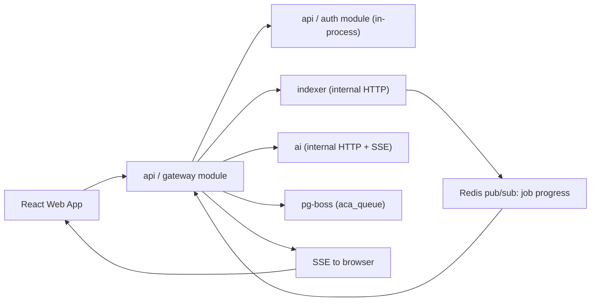

# API Service — Gateway Module

> **Deployable:** `api` (`@aca/api`) · **Port:** 3000 · **Database:** `aca_api`
> **Sibling module in the same deployable:** Auth & GitHub Identity (`AUTH_SERVICE_PLAN.md`)

## Purpose

The Gateway module is the only publicly reachable surface. It authenticates requests, resolves repository ownership, composes responses from `indexer` and `ai`, enqueues background work, and streams live indexing progress and chat tokens to the browser.

## Flow Chart



## Responsibilities

- Validate access-token JWTs and attach the user to the request.
- Resolve `userId` → `repoId` ownership, cached in Redis for 60 seconds.
- Mint short-lived internal service JWTs for calls to `indexer` and `ai`.
- Expose the public REST surface under `/api/v1`.
- Enqueue `repo.import.requested`, `repo.deleted`, and `user.deleted`.
- Stream indexing progress (SSE) and chat tokens (SSE passthrough).
- Apply rate limits and per-user quotas before any paid downstream call.
- Generate OpenAPI documentation from `packages/contracts`.

## Stateless Design

- No session state in memory. Access tokens are verified from claims; refresh state lives in `aca_api`.
- SSE connections are per-instance and clients reconnect with `Last-Event-ID`.
- Job state is read from `indexer`, never cached as truth.

### SSE fan-out across replicas — required design

`indexer` publishes progress to **Redis Pub/Sub** on channel `progress:{repoId}`. Every `api` replica subscribes and forwards to whichever clients it holds.

**Do not** consume progress from the job queue in the Gateway. With multiple replicas in one consumer group each message reaches exactly one replica — usually not the one holding the user's connection — and the progress bar silently stops. Redis Pub/Sub fans out to all replicas, which is the behaviour required here.

## Public APIs

```text
GET    /api/v1/auth/github/start
GET    /api/v1/auth/github/callback        -> 302 redirect to web app
POST   /api/v1/auth/refresh
POST   /api/v1/auth/logout
GET    /api/v1/auth/me

GET    /api/v1/github/repositories?cursor=&pageSize=
POST   /api/v1/repositories/import
GET    /api/v1/repositories?cursor=&pageSize=
GET    /api/v1/repositories/:repoId
DELETE /api/v1/repositories/:repoId
POST   /api/v1/repositories/:repoId/reindex
GET    /api/v1/repositories/:repoId/job
GET    /api/v1/repositories/:repoId/events          (SSE)

GET    /api/v1/repositories/:repoId/tree
GET    /api/v1/repositories/:repoId/graph/folders
GET    /api/v1/repositories/:repoId/graph/dependencies
GET    /api/v1/repositories/:repoId/graph/symbols
GET    /api/v1/repositories/:repoId/graph/nodes/:nodeId/neighbors?depth=
GET    /api/v1/repositories/:repoId/files/:fileId/content?startLine=&endLine=

POST   /api/v1/repositories/:repoId/conversations
GET    /api/v1/repositories/:repoId/conversations
GET    /api/v1/conversations/:conversationId/messages
POST   /api/v1/conversations/:conversationId/messages   (SSE token stream)

GET    /health/live
GET    /health/ready
```

All list endpoints are cursor-paginated. All responses and errors use the shapes in `packages/contracts` and `API_ERROR_CODES.md`.

## Jobs Enqueued

- `repo.import.requested`
- `repo.deleted`
- `user.deleted`

The Gateway consumes no jobs. Progress arrives via Redis Pub/Sub; chat is synchronous.

## Database Ownership

The Gateway module owns **no tables**.

The original plan gave the Gateway an audit-log database. That has been removed: it was an entire database, connection pool, migration folder, and readiness dependency for a table nothing read, and it was the only thing making the public entry point stateful. The structured access log already carries `route`, `method`, `statusCode`, `requestId`, `correlationId`, and `userId`. Add a persisted audit table only when a named compliance requirement asks for one.

The `api` deployable's tables all belong to the Auth module.

## Internal Service Tokens

```ts
// HS256, secret INTERNAL_JWT_SECRET, 60s TTL
{
  iss: "api",
  aud: "indexer" | "ai",
  sub: userId,
  repoId?: string,        // present for repo-scoped calls; downstream trusts it
  scope: string[],        // e.g. ["repo:read", "repo:write"]
  jti: uuid,
  exp: number
}
```

Downstream services validate `iss`, `aud`, `exp`, and signature, then trust `sub` and `repoId`. This is what makes it safe for `indexer` and `ai` tables to carry no `user_id`.

## Environment Variables

```text
NODE_ENV
PORT=3000
PUBLIC_APP_URL
PUBLIC_API_URL
DATABASE_URL                     # aca_api
QUEUE_DATABASE_URL               # aca_queue
REDIS_URL
JWT_ACCESS_PUBLIC_KEY
JWT_ACCESS_PRIVATE_KEY
JWT_ACCESS_TTL_SECONDS=900
INTERNAL_JWT_SECRET
INTERNAL_JWT_TTL_SECONDS=60
INDEXER_SERVICE_URL
AI_SERVICE_URL
CORS_ALLOWED_ORIGINS
RATE_LIMIT_DEFAULT_PER_MINUTE=300
RATE_LIMIT_IMPORT_PER_HOUR=5
RATE_LIMIT_CHAT_PER_HOUR=20
OWNERSHIP_CACHE_TTL_SECONDS=60
SSE_HEARTBEAT_SECONDS=15
```

Defaults for every limit are listed in `SCOPE_LIMITS.md`.

## Security

- `/internal/*` is not served by this deployable; the Gateway is a client of internal routes, not a provider.
- Reject any request whose `repoId` fails the ownership check, with `403 REPO_FORBIDDEN` — never `404`-leak a different user's repository ID differently from a nonexistent one.
- Rate-limit per user and per IP; return `429` with `Retry-After`.
- Enforce quotas from `SCOPE_LIMITS.md` **before** forwarding to `ai`, so a paid call is never made for a request that will be rejected.
- Strict CORS allowlist; refresh cookie is `HttpOnly`, `Secure`, `SameSite=Strict`.
- Never proxy an internal error body to the browser.

## Docker and Deployment

- Image `aca/api`, port 3000, behind an HTTPS load balancer.
- Scale horizontally; SSE requires no sticky sessions thanks to Redis fan-out.
- Readiness verifies `aca_api`, Redis, `aca_queue`, and reachability of `indexer` and `ai`.
- Graceful shutdown closes SSE streams with a retry hint before exiting.

## Testing

- Request/response validation against contract schemas.
- Auth guard and internal-token issuing tests.
- Ownership resolution and cache-invalidation tests.
- **Multi-replica SSE test:** two Gateway instances, one client on each, one progress publish — both clients must receive it.
- Rate limit and quota rejection tests.
- Error envelope shape tests for every documented error code.

## Implementation Steps

1. NestJS + Fastify app, global validation pipe from `packages/contracts`, global error filter.
2. Access-token guard and request context (`requestId`, `correlationId`).
3. Ownership resolver with Redis cache.
4. Internal token service and typed HTTP clients for `indexer` and `ai`.
5. REST controllers, cursor pagination, OpenAPI generation.
6. Redis Pub/Sub subscriber and SSE progress endpoint with heartbeats and `Last-Event-ID`.
7. Chat SSE passthrough to `ai`.
8. Rate limits, quotas, CORS, security headers.
