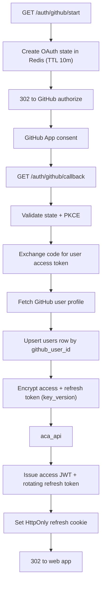

# API Service — Auth and GitHub Identity Module

> **Deployable:** `api` (`@aca/api`) · **Port:** 3000 · **Database:** `aca_api`
> **Sibling module in the same deployable:** Gateway (`API_GATEWAY_SERVICE_PLAN.md`)

## Purpose

This module owns user identity, sessions, the GitHub connection, and (per `adr/0006-email-password-auth.md`) email/password credentials. A user may sign in with GitHub, with email/password, or both — GitHub is no longer required to have an account, only to import and index repositories. This is also the only place in the architecture where GitHub tokens and password hashes are stored.

## Why both identity methods

ADR 0002 originally made GitHub the only identity provider, since the product couldn't do anything for a user without one and passwords bring their own subsystem (hashing, verification, reset, lockout). `adr/0006-email-password-auth.md` reverses the "only": users can now create an account with just an email and password, and connect GitHub afterward, whenever they're ready to import a repository. GitHub remains the only *OAuth* provider, so there is still no `oauth_identities` table — `github_user_id` just becomes a nullable, unique-when-present column on `users` instead of a required one.

Because a user can now have no GitHub connection at all, the UI must handle that state explicitly (no repositories yet, "Connect GitHub" prompt) rather than assuming it never happens.

## Flow Chart



## Responsibilities

- GitHub OAuth start, state/PKCE handling, and callback (sign-in).
- GitHub account linking and unlinking for an already-authenticated user (separate from sign-in).
- Email/password signup, login, email verification, and password reset.
- Create or update the user from the GitHub profile, or from a verified email/password signup.
- Encrypt, store, refresh, and hand out GitHub tokens just-in-time.
- Hash and verify passwords (Argon2id); lock an account out after repeated failed logins.
- Issue JWT access tokens and rotating hashed refresh tokens.
- Logout and session revocation.
- Serve `/auth/me`.
- Provide the internal endpoint `indexer` uses to obtain a GitHub token for one job.

## Stateless Design

- No in-memory sessions. Refresh sessions live in `aca_api`.
- Access tokens are verified from signature and claims alone.
- Revocation is expressed through refresh-session state.
- OAuth `state` lives in Redis with a TTL and is single-use.

## APIs

```text
GET  /api/v1/auth/github/start          -> 302 to GitHub                 (sign-in)
GET  /api/v1/auth/github/callback       -> 302 to PUBLIC_APP_URL         (sign-in)
GET  /api/v1/auth/github/link/start     -> 302 to GitHub                 (link to current user, auth required)
GET  /api/v1/auth/github/link/callback  -> 302 to PUBLIC_APP_URL         (link)
POST /api/v1/auth/github/unlink                                          (auth required)

POST /api/v1/auth/signup                (body: { email, password })
POST /api/v1/auth/login                 (body: { email, password })
POST /api/v1/auth/verify-email          (body: { token })
POST /api/v1/auth/resend-verification   (auth required)
POST /api/v1/auth/forgot-password       (body: { email })
POST /api/v1/auth/reset-password        (body: { token, newPassword })

POST /api/v1/auth/refresh
POST /api/v1/auth/logout
GET  /api/v1/auth/me

POST /internal/github/token             (body: { userId }) -> { token, expiresAt }
GET  /internal/users/:userId
```

The GitHub callbacks **redirect to the web app** and never return JSON. Errors redirect to `/login?error=<code>` (sign-in) or `/settings?error=<code>` (link) so the browser is never left on an API URL. The email/password endpoints are plain JSON APIs — there's no browser redirect to manage.

`POST /internal/github/token` decrypts, refreshes if near expiry, and returns a token for a single job. It requires a valid internal service token, is rate-limited per user, and every call is logged with `jobId`. The token is never persisted outside `aca_api`.

**GitHub linking vs. sign-in.** `github/link/start` requires the caller to already have a valid session — but since it's a top-level browser navigation (not a fetch call), the access token can't travel as an `Authorization` header. It identifies the user the same way the OAuth flow already does elsewhere: from the `HttpOnly` refresh cookie sent automatically on the request. The OAuth `state` stored in Redis for this attempt carries a `mode: "link"` flag and the target `userId`; the callback attaches the GitHub identity to that user instead of creating or signing into a different one. If that GitHub account is already linked to a different user, the callback redirects with `AUTH_GITHUB_ALREADY_LINKED`. Unlinking is rejected with `AUTH_CANNOT_UNLINK_LAST_METHOD` when the user has no `password_hash` — GitHub would otherwise be their only way back in.

## Jobs

Published: `user.deleted` (on account deletion).
Consumed: none.

## Database Ownership

```text
services/api/migrations/
  001_create_users.sql
  002_create_refresh_sessions.sql
  003_create_processed_events.sql
  004_add_password_auth.sql
  005_create_email_verification_tokens.sql
  006_create_password_reset_tokens.sql
```

```sql
CREATE TABLE IF NOT EXISTS users (
  id                        uuid PRIMARY KEY,
  github_user_id            text UNIQUE,             -- nullable: a password-only user has none yet
  github_login              text,
  email                     text,
  display_name              text,
  avatar_url                text,
  encrypted_access_token    text,
  encrypted_refresh_token   text,
  token_expires_at          timestamptz,
  key_version               integer NOT NULL DEFAULT 1,
  github_scopes             text[] NOT NULL DEFAULT '{}',
  disconnected_at           timestamptz,
  password_hash             text,                    -- Argon2id; nullable: a GitHub-only user has none
  email_verified_at         timestamptz,
  failed_login_attempts     integer NOT NULL DEFAULT 0,
  locked_until               timestamptz,
  created_at                timestamptz NOT NULL DEFAULT now(),
  updated_at                timestamptz NOT NULL DEFAULT now(),
  CONSTRAINT users_has_an_identity CHECK (github_user_id IS NOT NULL OR password_hash IS NOT NULL)
);

CREATE INDEX IF NOT EXISTS idx_users_github_login ON users (github_login);
CREATE UNIQUE INDEX IF NOT EXISTS idx_users_email ON users (email) WHERE email IS NOT NULL;

CREATE TABLE IF NOT EXISTS email_verification_tokens (
  id           uuid PRIMARY KEY,
  user_id      uuid NOT NULL REFERENCES users(id) ON DELETE CASCADE,
  token_hash   text NOT NULL UNIQUE,
  expires_at   timestamptz NOT NULL,
  consumed_at  timestamptz,
  created_at   timestamptz NOT NULL DEFAULT now()
);

CREATE INDEX IF NOT EXISTS idx_email_verification_tokens_user ON email_verification_tokens (user_id);

CREATE TABLE IF NOT EXISTS password_reset_tokens (
  id           uuid PRIMARY KEY,
  user_id      uuid NOT NULL REFERENCES users(id) ON DELETE CASCADE,
  token_hash   text NOT NULL UNIQUE,
  expires_at   timestamptz NOT NULL,
  consumed_at  timestamptz,
  created_at   timestamptz NOT NULL DEFAULT now()
);

CREATE INDEX IF NOT EXISTS idx_password_reset_tokens_user ON password_reset_tokens (user_id);

CREATE TABLE IF NOT EXISTS refresh_sessions (
  id              uuid PRIMARY KEY,
  user_id         uuid NOT NULL REFERENCES users(id) ON DELETE CASCADE,
  token_hash      text NOT NULL UNIQUE,
  parent_id       uuid REFERENCES refresh_sessions(id) ON DELETE SET NULL,
  user_agent      text,
  ip_hash         text,
  expires_at      timestamptz NOT NULL,
  revoked_at      timestamptz,
  created_at      timestamptz NOT NULL DEFAULT now()
);

CREATE INDEX IF NOT EXISTS idx_refresh_sessions_user_active
  ON refresh_sessions (user_id) WHERE revoked_at IS NULL;

CREATE TABLE IF NOT EXISTS processed_events (
  event_id     uuid NOT NULL,
  consumer     text NOT NULL,
  processed_at timestamptz NOT NULL DEFAULT now(),
  PRIMARY KEY (event_id, consumer)
);
```

There is deliberately still **no `oauth_identities` table** (`adr/0006-email-password-auth.md`) — GitHub remains the only *OAuth* provider, so `github_user_id` living directly on `users` is enough. `password_hash` is now present because email/password is a second, non-OAuth identity method on the same row; the `users_has_an_identity` check constraint guarantees a row is never left with neither.

`parent_id` on `refresh_sessions` enables reuse detection: if a already-rotated refresh token is presented, the entire session chain is revoked and the event is logged as a `warn`.

## Token Encryption

- AES-256-GCM with a data key derived per row, wrapped by `TOKEN_ENCRYPTION_KEY_V{n}`.
- `key_version` is stored per row so keys can be rotated without a downtime migration.
- Rotation procedure: add `TOKEN_ENCRYPTION_KEY_V2`, set `TOKEN_ENCRYPTION_ACTIVE_VERSION=2`, run a background re-wrap job, then retire v1.
- The original plan's `token_last_four` column is removed: no UI uses it, it gives no verification value for an opaque token, and it puts fragments of secret material into logs and backups.

## GitHub App, not an OAuth App

Register a **GitHub App** rather than a classic OAuth App:

- users grant access per repository, which materially increases install rates for private repos;
- 5,000 requests/hour per installation instead of per user;
- short-lived user tokens (8 hours) with refresh tokens, instead of long-lived tokens;
- webhooks come free, enabling push-triggered re-indexing later.

Requested permissions: `Contents: Read-only`, `Metadata: Read-only`. Nothing else.

Because user tokens expire, `token_expires_at` and `encrypted_refresh_token` are mandatory, and `POST /internal/github/token` refreshes transparently when the token is within `TOKEN_REFRESH_MARGIN_SECONDS` of expiry. A failed refresh returns `GITHUB_RECONNECT_REQUIRED`, which the UI presents as "reconnect GitHub" rather than an error.

## Environment Variables

```text
NODE_ENV
PORT=3000
PUBLIC_APP_URL
DATABASE_URL                            # aca_api
REDIS_URL
GITHUB_APP_CLIENT_ID
GITHUB_APP_CLIENT_SECRET
GITHUB_CALLBACK_URL
GITHUB_API_BASE_URL=https://api.github.com
JWT_ACCESS_PRIVATE_KEY
JWT_ACCESS_PUBLIC_KEY
JWT_ACCESS_TTL_SECONDS=900
REFRESH_TOKEN_TTL_SECONDS=2592000
TOKEN_ENCRYPTION_KEY_V1
TOKEN_ENCRYPTION_ACTIVE_VERSION=1
TOKEN_REFRESH_MARGIN_SECONDS=300
OAUTH_STATE_TTL_SECONDS=600
INTERNAL_JWT_SECRET
RATE_LIMIT_REFRESH_PER_MINUTE=10
RATE_LIMIT_INTERNAL_GITHUB_TOKEN_PER_MINUTE=30

# adr/0006-email-password-auth.md
PASSWORD_HASH_MEMORY_COST_KIB=19456
PASSWORD_HASH_TIME_COST=2
PASSWORD_HASH_PARALLELISM=1
EMAIL_VERIFICATION_TTL_SECONDS=86400
PASSWORD_RESET_TTL_SECONDS=3600
LOGIN_LOCKOUT_THRESHOLD=5
LOGIN_LOCKOUT_DURATION_SECONDS=900
RATE_LIMIT_LOGIN_PER_MINUTE=10
RATE_LIMIT_SIGNUP_PER_HOUR=5
RATE_LIMIT_FORGOT_PASSWORD_PER_HOUR=5   # per IP — bounds how many reset emails one requester can trigger
```

Email delivery has no env var yet because there's exactly one implementation (`ConsoleEmailSender`, logs instead of sending). Swapping in a real provider means implementing the `EmailSender` interface and rebinding the `EMAIL_SENDER` DI token — a code change, not a config toggle, until a second implementation actually exists.

## Security

- Validate OAuth `state` against Redis and bind it to the browser via a short-lived `HttpOnly` cookie; use PKCE.
- Single-use `state`; delete on consumption.
- Never log tokens, codes, passwords, or GitHub responses containing them.
- Hash refresh tokens (SHA-256) before storage; rotate on every use; detect reuse.
- Refresh cookie: `HttpOnly`, `Secure`, `SameSite=Strict`, path-scoped to `/api/v1/auth`.
- Rate-limit `/auth/refresh`, `/auth/login`, `/auth/signup`, `/auth/forgot-password`, and `/internal/github/token`.
- Account deletion revokes all sessions, deletes the user row, and publishes `user.deleted`.
- Passwords hashed with Argon2id, never logged, never returned in any response.
- Login failure and password-reset responses don't reveal whether an email is registered (generic message, same response shape either way) — this is what keeps `/auth/forgot-password` from becoming an account-enumeration oracle.
- Failed logins increment `failed_login_attempts`; past `LOGIN_LOCKOUT_THRESHOLD` the account is locked until `locked_until`, independent of the per-IP rate limit (one stops a script hammering one account from many IPs, the other stops one IP hammering many accounts).
- Email verification and password reset tokens are single-use, hashed at rest (like refresh tokens), and expire.
- Unlinking GitHub is rejected when it's the user's only credential (`AUTH_CANNOT_UNLINK_LAST_METHOD`).

## Testing

- OAuth state and PKCE validation, including replay of a consumed state.
- Token exchange against a mocked GitHub App.
- Encryption round-trip and key-version rotation.
- Refresh rotation, expiry, revocation, and reuse detection revoking the chain.
- Expired GitHub token triggers refresh; failed refresh yields `GITHUB_RECONNECT_REQUIRED`.
- Internal token endpoint rejects requests without a valid internal service token.
- Migrations apply cleanly from an empty database.
- Password hash round-trip; wrong password rejected without revealing which field was wrong.
- Lockout after `LOGIN_LOCKOUT_THRESHOLD` failed attempts; cleared on a subsequent success.
- Email verification and password reset: valid token succeeds once, a second use and an expired token both fail.
- GitHub link attaches to the authenticated user, not a new one; linking an already-linked GitHub account fails with `AUTH_GITHUB_ALREADY_LINKED`; unlinking a user's only credential fails with `AUTH_CANNOT_UNLINK_LAST_METHOD`.

## Implementation Steps

1. Register the GitHub App and wire callback URLs.
2. Migrations for `users`, `refresh_sessions`, `processed_events`, `email_verification_tokens`, `password_reset_tokens`.
3. OAuth start with state + PKCE in Redis (sign-in and link modes).
4. Callback: exchange, profile fetch, user upsert or link, token encryption.
5. JWT issuing and rotating hashed refresh sessions with reuse detection.
6. `/auth/me`, logout, account deletion.
7. `POST /internal/github/token` with transparent refresh.
8. Key-rotation re-wrap job.
9. Signup, login, lockout, and the `EmailSender` interface with a console-logging stub.
10. Email verification and password reset token issuing/consumption.
11. GitHub link/unlink for an already-authenticated user.
