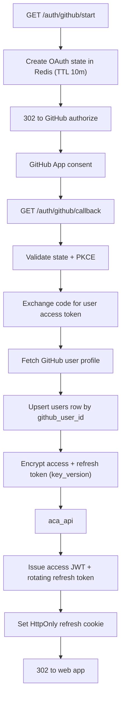

# API Service — Auth and GitHub Identity Module

> **Deployable:** `api` (`@aca/api`) · **Port:** 3000 · **Database:** `aca_api`
> **Sibling module in the same deployable:** Gateway (`API_GATEWAY_SERVICE_PLAN.md`)

## Purpose

This module owns user identity, sessions, and the GitHub connection. **GitHub is the only identity provider** — there are no passwords in the system. It is also the only place in the architecture where GitHub tokens are stored.

## Why GitHub-only sign-in

The product cannot function for a user who has not connected GitHub. Keeping email and password alongside it would mean building and maintaining password hashing, credential-stuffing defence, email verification, password reset, and a transactional email provider — none of which were in the original plan, and all of which are required if passwords exist — for zero additional product capability. See `adr/0002-github-only-auth.md`.

Sign-in and repository access are therefore the same consent, which also removes the "signed up but never connected GitHub" dead-end state from the UI.

## Flow Chart



## Responsibilities

- GitHub OAuth start, state/PKCE handling, and callback.
- Create or update the user from the GitHub profile.
- Encrypt, store, refresh, and hand out GitHub tokens just-in-time.
- Issue JWT access tokens and rotating hashed refresh tokens.
- Logout and session revocation.
- Serve `/auth/me`.
- Provide the internal endpoint `indexer` uses to obtain a GitHub token for one job.

## Stateless Design

- No in-memory sessions. Refresh sessions live in `aca_api`.
- Access tokens are verified from signature and claims alone.
- Revocation is expressed through refresh-session state.
- OAuth `state` lives in Redis with a TTL and is single-use.

## APIs

```text
GET  /api/v1/auth/github/start          -> 302 to GitHub
GET  /api/v1/auth/github/callback       -> 302 to PUBLIC_APP_URL
POST /api/v1/auth/refresh
POST /api/v1/auth/logout
GET  /api/v1/auth/me

POST /internal/github/token             (body: { userId }) -> { token, expiresAt }
GET  /internal/users/:userId
```

The callback **redirects to the web app** and never returns JSON. Errors redirect to `/(login)?error=<code>` so the browser is never left on an API URL.

`POST /internal/github/token` decrypts, refreshes if near expiry, and returns a token for a single job. It requires a valid internal service token, is rate-limited per user, and every call is logged with `jobId`. The token is never persisted outside `aca_api`.

## Jobs

Published: `user.deleted` (on account deletion).
Consumed: none.

## Database Ownership

```text
services/api/migrations/
  001_create_users.sql
  002_create_refresh_sessions.sql
  003_create_processed_events.sql
```

```sql
CREATE TABLE IF NOT EXISTS users (
  id                        uuid PRIMARY KEY,
  github_user_id            text NOT NULL UNIQUE,
  github_login              text NOT NULL,
  email                     text,
  display_name              text,
  avatar_url                text,
  encrypted_access_token    text NOT NULL,
  encrypted_refresh_token   text,
  token_expires_at          timestamptz,
  key_version               integer NOT NULL DEFAULT 1,
  github_scopes             text[] NOT NULL DEFAULT '{}',
  disconnected_at           timestamptz,
  created_at                timestamptz NOT NULL DEFAULT now(),
  updated_at                timestamptz NOT NULL DEFAULT now()
);

CREATE INDEX IF NOT EXISTS idx_users_github_login ON users (github_login);

CREATE TABLE IF NOT EXISTS refresh_sessions (
  id              uuid PRIMARY KEY,
  user_id         uuid NOT NULL REFERENCES users(id) ON DELETE CASCADE,
  token_hash      text NOT NULL UNIQUE,
  parent_id       uuid REFERENCES refresh_sessions(id) ON DELETE SET NULL,
  user_agent      text,
  ip_hash         text,
  expires_at      timestamptz NOT NULL,
  revoked_at      timestamptz,
  created_at      timestamptz NOT NULL DEFAULT now()
);

CREATE INDEX IF NOT EXISTS idx_refresh_sessions_user_active
  ON refresh_sessions (user_id) WHERE revoked_at IS NULL;

CREATE TABLE IF NOT EXISTS processed_events (
  event_id     uuid NOT NULL,
  consumer     text NOT NULL,
  processed_at timestamptz NOT NULL DEFAULT now(),
  PRIMARY KEY (event_id, consumer)
);
```

There is deliberately **no `password_hash` column** and no `oauth_identities` table — with a single provider, the identity is the user.

`parent_id` on `refresh_sessions` enables reuse detection: if a already-rotated refresh token is presented, the entire session chain is revoked and the event is logged as a `warn`.

## Token Encryption

- AES-256-GCM with a data key derived per row, wrapped by `TOKEN_ENCRYPTION_KEY_V{n}`.
- `key_version` is stored per row so keys can be rotated without a downtime migration.
- Rotation procedure: add `TOKEN_ENCRYPTION_KEY_V2`, set `TOKEN_ENCRYPTION_ACTIVE_VERSION=2`, run a background re-wrap job, then retire v1.
- The original plan's `token_last_four` column is removed: no UI uses it, it gives no verification value for an opaque token, and it puts fragments of secret material into logs and backups.

## GitHub App, not an OAuth App

Register a **GitHub App** rather than a classic OAuth App:

- users grant access per repository, which materially increases install rates for private repos;
- 5,000 requests/hour per installation instead of per user;
- short-lived user tokens (8 hours) with refresh tokens, instead of long-lived tokens;
- webhooks come free, enabling push-triggered re-indexing later.

Requested permissions: `Contents: Read-only`, `Metadata: Read-only`. Nothing else.

Because user tokens expire, `token_expires_at` and `encrypted_refresh_token` are mandatory, and `POST /internal/github/token` refreshes transparently when the token is within `TOKEN_REFRESH_MARGIN_SECONDS` of expiry. A failed refresh returns `GITHUB_RECONNECT_REQUIRED`, which the UI presents as "reconnect GitHub" rather than an error.

## Environment Variables

```text
NODE_ENV
PORT=3000
PUBLIC_APP_URL
DATABASE_URL                            # aca_api
REDIS_URL
GITHUB_APP_CLIENT_ID
GITHUB_APP_CLIENT_SECRET
GITHUB_CALLBACK_URL
GITHUB_API_BASE_URL=https://api.github.com
JWT_ACCESS_PRIVATE_KEY
JWT_ACCESS_PUBLIC_KEY
JWT_ACCESS_TTL_SECONDS=900
REFRESH_TOKEN_TTL_SECONDS=2592000
TOKEN_ENCRYPTION_KEY_V1
TOKEN_ENCRYPTION_ACTIVE_VERSION=1
TOKEN_REFRESH_MARGIN_SECONDS=300
OAUTH_STATE_TTL_SECONDS=600
INTERNAL_JWT_SECRET
```

## Security

- Validate OAuth `state` against Redis and bind it to the browser via a short-lived `HttpOnly` cookie; use PKCE.
- Single-use `state`; delete on consumption.
- Never log tokens, codes, or GitHub responses containing them.
- Hash refresh tokens (SHA-256) before storage; rotate on every use; detect reuse.
- Refresh cookie: `HttpOnly`, `Secure`, `SameSite=Strict`, path-scoped to `/api/v1/auth`.
- Rate-limit `/auth/refresh` and `/internal/github/token`.
- Account deletion revokes all sessions, deletes the user row, and publishes `user.deleted`.

## Testing

- OAuth state and PKCE validation, including replay of a consumed state.
- Token exchange against a mocked GitHub App.
- Encryption round-trip and key-version rotation.
- Refresh rotation, expiry, revocation, and reuse detection revoking the chain.
- Expired GitHub token triggers refresh; failed refresh yields `GITHUB_RECONNECT_REQUIRED`.
- Internal token endpoint rejects requests without a valid internal service token.
- Migrations apply cleanly from an empty database.

## Implementation Steps

1. Register the GitHub App and wire callback URLs.
2. Migrations for `users`, `refresh_sessions`, `processed_events`.
3. OAuth start with state + PKCE in Redis.
4. Callback: exchange, profile fetch, user upsert, token encryption.
5. JWT issuing and rotating hashed refresh sessions with reuse detection.
6. `/auth/me`, logout, account deletion.
7. `POST /internal/github/token` with transparent refresh.
8. Key-rotation re-wrap job.
