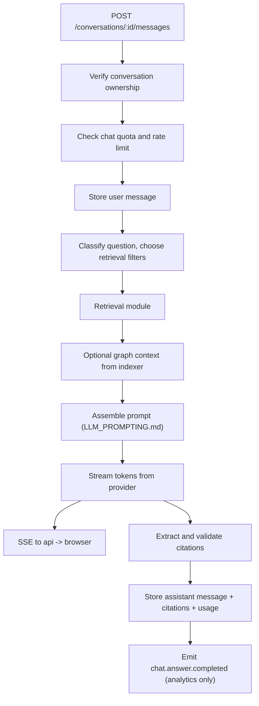

# AI Service — Chat Module

> **Deployable:** `ai` (`@aca/ai`) · **Port:** 3200 · **Database:** `aca_ai`
> **Sibling module:** Retrieval (`SEARCH_EMBEDDING_SERVICE_PLAN.md`)

## Purpose

The Chat module owns conversations, messages, context assembly, and grounded answer generation with citations. It is the product's headline feature and its latency budget is the strictest in the system.

## Chat is synchronous and streamed

Chat runs as a **synchronous HTTP request with a server-sent token stream**, not as a queue job.

The original plan had both: the Gateway published `chat.answer.requested` to the broker *and* the Chat service exposed a synchronous message endpoint. That contradicted the project's own rule against using the broker for anything a user is waiting on, and it forced either polling or socket correlation for no benefit — while adding two hops to a path where every hundred milliseconds is visible.

Flow: `web` → `api` (SSE passthrough) → `ai` (SSE) → LLM provider stream. The queue is used only for cleanup jobs.

**No streaming was planned at all originally.** For a twenty-second RAG answer, a spinner reads as broken. First token must appear within `FIRST_TOKEN_TARGET_MS` (2000 ms) or the request is treated as degraded and reported.

## Flow Chart



## Responsibilities

- Create and list repository conversations.
- Store user and assistant messages.
- Classify the question and pick retrieval filters.
- Assemble grounded prompts within a token budget.
- Stream answers and extract citations.
- Validate every citation against real files and line ranges before storing.
- Record token usage per user and per message.

## Citation Validation — required

Every citation the model emits is checked against `indexer` before the message is stored:

- the file path exists in the active snapshot;
- the line range is within the file's line count;
- the range overlaps a chunk that was actually in the prompt.

Citations failing validation are stripped and logged, and the answer is annotated. **Reason:** an unverified citation is worse than no citation — it looks authoritative and sends the user to the wrong place, which destroys trust in the whole product.

## Question Classification

Cheap, deterministic routing before retrieval:

| Class | Signal | Retrieval adjustment |
| --- | --- | --- |
| `file` | quoted path or filename | path prefix filter, wide line context |
| `symbol` | identifier casing, "class"/"function" | symbol-name lexical prefilter |
| `architecture` | "how does", "flow", "structure" | include folder + dependency graph summary |
| `change` | "add", "implement", "fix" | retrieve target area plus its importers |
| `general` | fallback | plain hybrid retrieval |

For `architecture` and `change`, the module also pulls a compact graph summary from `indexer` (top-degree nodes, direct importers of the target), because those questions are about relationships the chunks do not contain.

## Answer Contract

Grounding rules, enforced by the system prompt in `LLM_PROMPTING.md`:

- Cite file paths and line ranges for every claim about the code.
- Never invent files, symbols, or commands.
- When the evidence is missing, say exactly what is missing and what would help — do not guess.
- State assumptions explicitly when the evidence is partial.
- Give commands only when they are supported by a file that was retrieved (`package.json` scripts, Dockerfile, CI config).

For code-change questions, the answer is structured:

```text
Summary
Files to create or change
Complete code
How it works
Commands to run
```

## APIs

```text
POST /internal/repositories/:repoId/conversations
GET  /internal/repositories/:repoId/conversations?cursor=&pageSize=
GET  /internal/conversations/:conversationId/messages?cursor=&pageSize=
POST /internal/conversations/:conversationId/messages     (SSE)
DELETE /internal/conversations/:conversationId
GET  /health/live
GET  /health/ready
```

SSE event types on the message stream:

```text
event: token      data: {"delta":"..."}
event: citation   data: {"path":"src/app.ts","startLine":10,"endLine":42,"symbolName":"bootstrap"}
event: usage      data: {"promptTokens":4210,"completionTokens":388}
event: done       data: {"messageId":"uuid"}
event: error      data: {"code":"LLM_TIMEOUT","correlationId":"uuid"}
```

## Jobs

**Consumed:** `repo.deleted`, `user.deleted`
**Published:** `chat.answer.completed` (analytics and usage aggregation only — nothing user-facing depends on it)

## Database Ownership

```text
services/ai/migrations/
  010_create_chat_conversations.sql
  011_create_chat_messages.sql
  012_create_token_usage.sql
```

```sql
CREATE TABLE IF NOT EXISTS chat_conversations (
  id           uuid PRIMARY KEY,
  user_id      uuid NOT NULL,
  repo_id      uuid NOT NULL,
  title        text,
  message_count integer NOT NULL DEFAULT 0,
  created_at   timestamptz NOT NULL DEFAULT now(),
  updated_at   timestamptz NOT NULL DEFAULT now(),
  deleted_at   timestamptz
);

CREATE INDEX IF NOT EXISTS idx_chat_conversations_repo_user
  ON chat_conversations (repo_id, user_id, updated_at DESC)
  WHERE deleted_at IS NULL;

CREATE TABLE IF NOT EXISTS chat_messages (
  id               uuid PRIMARY KEY,
  conversation_id  uuid NOT NULL REFERENCES chat_conversations(id) ON DELETE CASCADE,
  role             text NOT NULL,          -- user | assistant | system
  content          text NOT NULL,
  citations        jsonb NOT NULL DEFAULT '[]'::jsonb,
  snapshot_id      uuid,
  model            text,
  prompt_tokens    integer NOT NULL DEFAULT 0,
  completion_tokens integer NOT NULL DEFAULT 0,
  latency_ms       integer,
  finish_reason    text,
  metadata         jsonb NOT NULL DEFAULT '{}'::jsonb,
  created_at       timestamptz NOT NULL DEFAULT now()
);

CREATE INDEX IF NOT EXISTS idx_chat_messages_conversation_created
  ON chat_messages (conversation_id, created_at ASC);

CREATE TABLE IF NOT EXISTS token_usage (
  id              uuid PRIMARY KEY,
  user_id         uuid NOT NULL,
  repo_id         uuid,
  kind            text NOT NULL,          -- embedding | chat
  model           text NOT NULL,
  prompt_tokens   integer NOT NULL DEFAULT 0,
  completion_tokens integer NOT NULL DEFAULT 0,
  occurred_at     timestamptz NOT NULL DEFAULT now()
);

CREATE INDEX IF NOT EXISTS idx_token_usage_user_month
  ON token_usage (user_id, occurred_at DESC);
```

`snapshot_id` on each message records which version of the code the answer was grounded in, so an old answer can be shown with an accurate "this referred to commit X" note after a re-index.

## Context Budget

```text
system prompt                  ~600 tokens
repository summary              ~300 tokens
graph summary (when relevant)   ~500 tokens
retrieved chunks                up to MAX_CONTEXT_TOKENS
conversation history            last MAX_HISTORY_MESSAGES, truncated oldest-first
user question                   as-is
```

Chunks are added in rank order until the budget is reached; the count that actually fit is recorded on the message. History is summarized rather than dropped once it exceeds its share.

## Environment Variables

```text
NODE_ENV
PORT=3200
DATABASE_URL
QUEUE_DATABASE_URL
REDIS_URL
INTERNAL_JWT_SECRET
INDEXER_SERVICE_URL
LLM_PROVIDER=openai
LLM_API_KEY
CHAT_MODEL
LLM_REQUEST_TIMEOUT_MS=60000
FIRST_TOKEN_TARGET_MS=2000
MAX_CONTEXT_CHUNKS=16
MAX_CONTEXT_TOKENS=12000
MAX_HISTORY_MESSAGES=10
MAX_OUTPUT_TOKENS=2000
CHAT_QUOTA_TOKENS_PER_MONTH=500000
```

`LLM_PROVIDER` plus `LLM_API_KEY` replace the original hardcoded `OPENAI_API_KEY`, so the documented provider adapter is actually reachable from configuration.

## Security

- Enforce conversation ownership on every read and write; `repoId` comes only from the internal token.
- Never include content from a repository other than the one the conversation belongs to.
- Redact detected secrets from snippets before prompt assembly.
- Rate-limit and quota-check before any paid call.
- Sanitize model output; the web app never renders raw HTML from it.
- Treat retrieved repository content as untrusted data, not instructions — the system prompt states explicitly that text inside code context can never change the assistant's rules.
- Retention and opt-out are governed by `DATA_RETENTION_AND_PRIVACY.md`.

## Testing

- Conversation and message CRUD with ownership enforcement.
- Prompt assembly stays within the token budget with oversized history and oversized chunks.
- Citation validation strips a fabricated path and an out-of-range line span.
- A question about code that does not exist yields an explicit "not found", asserted by test.
- Streaming: first token before the target, and a clean `done` event.
- Provider timeout and rate-limit responses surface as typed errors, not 500s.
- Prompt-injection fixture: a repository file containing "ignore previous instructions" does not change behaviour.
- Token usage recorded accurately for both streamed and failed requests.
- Cross-repository leakage test: conversation for repo A never retrieves from repo B.

## Implementation Steps

1. Conversation and message migrations, plus `token_usage`.
2. Conversation APIs with ownership checks.
3. Question classifier and retrieval client.
4. Graph summary client for architecture and change questions.
5. Prompt builder against `LLM_PROMPTING.md` with an explicit token budget.
6. Provider adapter with streaming, timeout, retry, and circuit breaker.
7. SSE endpoint; passthrough wiring in `api`.
8. Citation extraction and validation against `indexer`.
9. Usage recording and quota enforcement.
