# AI Code Archaeologist — Codebase Engineering Specification

## Product Goal

AI Code Archaeologist lets a user sign in with GitHub, select a repository, index its codebase, inspect folder / dependency / symbol graphs, and ask repo-grounded questions through an AI chat interface that cites real files and line ranges.

The system must support:

- Sign-in with GitHub (GitHub is the only identity provider — see `adr/0002-github-only-auth.md`).
- Repository selection and import.
- Background repository indexing driven by a durable job queue.
- Folder tree, dependency graph, and symbol (class/function) graph views.
- Repo-aware chat answers with cited files, symbols, and code snippets, streamed to the browser.
- Four independently deployable units.
- Per-service database ownership with raw SQL migrations.
- One root `package.json` for local development commands.

## Deployable Units

The system ships as **four** deployables. Module boundaries inside each deployable are strict, so any module can be extracted into its own service later without changing its contracts (see `adr/0001-four-deployables.md`).

| Deployable | Package | Port | Database | Modules |
| --- | --- | --- | --- | --- |
| `web` | `@aca/web` | 5173 (dev) | — | React SPA |
| `api` | `@aca/api` | 3000 | `aca_api` | gateway, auth, github-identity |
| `indexer` | `@aca/indexer` | 3100 | `aca_indexer` | repositories, snapshots, parser, graph, pipeline |
| `ai` | `@aca/ai` | 3200 | `aca_ai` | chunking, embeddings, retrieval, chat |

Shared infrastructure: PostgreSQL, Redis, S3-compatible object storage, and a dedicated `aca_queue` database hosting pg-boss.

## Technology Stack

- Frontend: React, TypeScript, Vite, React Router, TanStack Query, React Flow.
- Backend: NestJS, TypeScript, Fastify adapter.
- Job queue: **pg-boss** on PostgreSQL. The queue is treated as swappable infrastructure behind the contracts in `packages/contracts`; see `adr/0003-queue-not-kafka.md`.
- Primary database: PostgreSQL 16+.
- Cache / locks / SSE fan-out / OAuth state: Redis.
- Vector search: pgvector (HNSW index) inside the `aca_ai` database.
- Object storage: S3-compatible (MinIO locally) for repository archives and extracted file text.
- Authentication: GitHub OAuth (GitHub App), JWT access tokens, rotating refresh tokens.
- Containers: Docker and Docker Compose for local development.
- Observability: Prometheus metrics, structured JSON logs, correlation IDs. OpenTelemetry is deferred — see `adr/0005-defer-otel.md`.

## High-Level Architecture

```text
React Web App (@aca/web)
  |
  | HTTPS REST + SSE
  v
api  (gateway + auth + github identity)   [DB: aca_api]
  |                     \
  | internal HTTP        \ internal HTTP
  v                       v
indexer                   ai
[DB: aca_indexer]         [DB: aca_ai + pgvector]
  |    ^                    ^
  |    |  pg-boss jobs      |
  +----+--------------------+
        [DB: aca_queue]

Redis : cache, locks, OAuth state, SSE fan-out, rate limits
S3    : snapshot archives + extracted per-file text
```

### Why these boundaries

- `api` is the only process reachable from the internet. It owns identity and is the only holder of GitHub tokens.
- `indexer` is CPU-heavy and bursty. It scales on job depth and never touches user credentials.
- `ai` is IO-heavy and rate-limited by the LLM provider. It scales independently of parsing.
- Chat latency matters, so chat is a synchronous, streaming path and never goes through the queue.

## Service Ownership

| Deployable | Owns | Does Not Own |
| --- | --- | --- |
| `api` | Users, refresh sessions, GitHub identities and encrypted tokens, public REST surface, SSE progress fan-out, rate limits, authorization decisions | Repository data, graphs, chunks, conversations |
| `indexer` | **Repository identity (`repoId`)**, snapshots, file inventory, symbols, dependencies, graph nodes/edges, pipeline job state | User credentials, GitHub tokens, embeddings, chat |
| `ai` | Code chunks, embeddings, retrieval, conversations, messages, prompt assembly, LLM calls | Repository parsing, graphs, identity |
| `web` | Rendering, client-side routing, client state | Any durable data |

## Repository Identity — the canonical `repoId`

> **`repoId` is `indexer.repositories.id`.** The `indexer` deployable creates it and is the single source of truth.

Nothing else may mint a repository ID. Resolution rules:

- `api` lists a user's GitHub repositories **live from the GitHub API** and does not persist them.
- On import, `api` calls `POST /internal/repositories/import` on `indexer` with provider metadata.
- `indexer` upserts on `(owner_user_id, provider, provider_repo_id)` and returns the canonical `repoId`.
- Every subsequent event, table, and API path uses that `repoId`.

**Reason this is stated first:** every table in `indexer` and `ai` carries `repo_id`. If its origin is ambiguous, three deployables will disagree about what a repository is.

## Authorization Model

Ownership is resolved **once, at `api`**, and asserted downstream through a signed internal token.

1. `api` authenticates the user from the access-token JWT.
2. For any repo-scoped route, `api` verifies `userId` owns `repoId` by calling `indexer` (result cached in Redis for 60s).
3. `api` mints a short-lived **internal service JWT** (HS256, 60s TTL, `iss: api`, `aud: indexer|ai`, `sub: userId`, `repoId` claim) and sends it on the internal call.
4. `indexer` and `ai` validate that token and trust its `repoId` claim.

Consequences, stated so nobody "fixes" them later:

- `graph_nodes`, `code_chunks`, `repository_files`, and `code_symbols` deliberately carry **no `user_id`**. Ownership is not their concern.
- Internal routes (`/internal/*`) must never be exposed on the public ingress and must reject any request without a valid internal token.
- The internal secret (`INTERNAL_JWT_SECRET`) is separate from the user JWT keys.

## Repository Indexing Pipeline

Stages run in a fixed order. Each stage is a pg-boss job; each emits exactly one terminal stage event.

1. User signs in with GitHub and picks a repository.
2. `api` calls `indexer` to register the repository and enqueue `repo.import.requested`.
3. `indexer` resolves the default branch head commit SHA and downloads the repository tarball (`GET /repos/{owner}/{repo}/tarball/{sha}`), using a GitHub token fetched just-in-time from `api`. It never stores the token.
4. `indexer` uploads the archive to S3 and creates a `snapshot` row → `repo.snapshot.created`.
5. `indexer` safely extracts the archive, applies ignore rules, writes per-file text objects and a manifest to S3, and stores the file inventory → `repo.files.indexed`.
6. `indexer` parses TypeScript/JavaScript ASTs, extracting symbols and imports, and resolves imports to file IDs → `repo.symbols.extracted`, `repo.dependencies.extracted`.
7. `indexer` builds folder, dependency, and symbol graphs → `repo.graph.built`.
8. `indexer` enqueues `repo.index.requested` for `ai`, which chunks, embeds, and stores vectors → `repo.embeddings.completed`.
9. `indexer` marks the snapshot active and the job complete → `repo.processing.completed`.
10. `web` receives progress over SSE and unlocks graph and chat.

### Stage completion semantics

Large repositories produce batched work. To keep progress honest:

- Every stage event carries `{ stage, batchIndex, batchCount, itemsProcessed, totalItems }`.
- The pipeline advances **only** on the terminal event for a stage (`batchIndex === batchCount - 1`).
- Workers publish `repo.stage.failed` with `{ stage, errorCode, retryable }`. Only the pipeline module publishes the terminal `repo.processing.failed`, so no consumer can receive its own failure event.

## Snapshot Lifecycle

A repository can be imported many times. Exactly one snapshot is active.

- `repositories.active_snapshot_id` points at the snapshot the UI and chat read from.
- All graph, chunk, and symbol reads filter by the active snapshot.
- Cutover is atomic: `active_snapshot_id` is updated in a single transaction at `repo.processing.completed`.
- Superseded snapshots are retained for `SNAPSHOT_RETENTION_COUNT` (default 2) and then deleted by a scheduled `snapshot.prune` job, which removes rows and S3 objects.
- A re-import at an unchanged commit SHA is a no-op and returns the existing snapshot.

**Reason:** without an explicit active snapshot, the second import of a repository silently doubles storage and lets the graph and chat read mixed versions of the code. This is the most likely source of "why is it showing old code" bugs.

## Queue Contracts

Job names stay lowercase and dot-separated, matching the original event vocabulary so the queue can be swapped for a log-based broker later without renaming anything.

```text
repo.import.requested
repo.snapshot.created
repo.files.indexed
repo.symbols.extracted
repo.dependencies.extracted
repo.graph.built
repo.index.requested
repo.embeddings.completed
repo.stage.failed
repo.processing.completed
repo.processing.failed
repo.deleted
user.deleted
snapshot.prune
```

Every job payload uses this envelope:

```json
{
  "eventId": "uuid",
  "eventType": "repo.files.indexed",
  "version": 1,
  "occurredAt": "2026-08-19T10:30:00.000Z",
  "correlationId": "uuid",
  "causationId": "uuid",
  "userId": "uuid",
  "repoId": "uuid",
  "snapshotId": "uuid",
  "retryCount": 0,
  "payload": {}
}
```

Concrete `payload` schemas for every job name live in `EVENT_CONTRACTS.md` and are enforced by Zod schemas in `packages/contracts`. The envelope alone is not a contract.

Retry and failure policy:

- pg-boss retries with exponential backoff, `retryLimit` from config (default 3).
- Exhausted jobs land in pg-boss's dead-letter queue named `<job>.dlq`.
- Only idempotent stages are retried. Invalid input fails immediately with a non-retryable error code.

### Idempotency

Every consumer, in every deployable, uses the same table in its own database:

```sql
CREATE TABLE IF NOT EXISTS processed_events (
  event_id uuid NOT NULL,
  consumer text NOT NULL,
  processed_at timestamptz NOT NULL DEFAULT now(),
  PRIMARY KEY (event_id, consumer)
);
```

A handler inserts first; a unique-violation means the event was already handled and the handler returns successfully. A shared helper lives in `packages/queue`.

## Database Ownership

Each deployable owns its database and its migrations. No deployable reads or writes another's tables.

```text
services/api/migrations/
services/indexer/migrations/
services/ai/migrations/
```

Migration rules:

- Raw SQL only. File naming `NNN_short_description.sql`.
- Applied by **dbmate** (see `adr/0004-dbmate-migrations.md`) — not a hand-written runner duplicated per service.
- `uuid` primary keys, `timestamptz` timestamps, `created_at` / `updated_at` on mutable tables.
- Indexes for every documented lookup path.
- Foreign keys only within a single database.
- `jsonb` for provider-specific metadata, never for core searchable fields.
- Migrations run as a separate deployment step, never automatically on app boot in production.

## File Content Storage

The parser deletes its temporary directory after processing, so extracted source must live somewhere durable and cheap.

```text
s3://aca-snapshots/{repoId}/{snapshotId}/archive.tar.gz     original tarball
s3://aca-snapshots/{repoId}/{snapshotId}/manifest.json      file list + object keys + hashes
s3://aca-snapshots/{repoId}/{snapshotId}/files/{fileId}     UTF-8 text of one indexed file
```

- `ai` reads `manifest.json` and streams per-file objects to chunk and embed.
- Citation viewing (`GET /api/v1/repositories/:repoId/files/:fileId/content`) is a single S3 GET through `indexer`.
- Nothing large is ever put in a job payload; payloads carry object keys.
- Binary, ignored, oversized, and secret-matching files are never written.

**Reason:** without this, `ai` has no source of file text and the citation panel in the web app cannot be built — the original plan had no path for content to leave the parser.

## Import Resolution

Turning `import { x } from '../utils'` into a graph edge is the hardest part of the dependency feature and must be specified, not improvised.

Resolution order for TypeScript/JavaScript:

1. Bare specifier matching a workspace package name → internal package entry point.
2. Bare specifier otherwise → `external_package` node, edge recorded, no file target.
3. `tsconfig.json` `baseUrl` + `paths` aliases (nearest tsconfig to the importing file).
4. Relative path, probing extensions in order: exact, `.ts`, `.tsx`, `.d.ts`, `.js`, `.jsx`, `.mjs`, `.cjs`.
5. Directory → `index.*` using the same extension order.
6. `package.json` `exports` / `main` for workspace-internal packages.
7. Otherwise → `unresolved`.

`file_dependencies.resolution_status` is one of `resolved` | `external` | `unresolved`. Unresolved imports are stored and surfaced in the UI, never silently dropped.

**Reason:** without documented resolution, a real repository's dependency graph is missing a large fraction of its edges, and the dependency graph is the flagship feature.

## Language Support and Graceful Degradation

v1 parses **TypeScript and JavaScript only**. Users will connect Python, Java, Go, and C# repositories on day one, so unsupported languages must still produce a useful product:

| Capability | TS/JS | Other languages |
| --- | --- | --- |
| File inventory | yes | yes |
| Folder tree / folder graph | yes | yes |
| Chunking + embeddings + chat | yes | yes (line-window chunking) |
| Symbol graph | yes | no |
| Dependency graph | yes | no |

The UI must state plainly which graphs are unavailable and why. Later versions add parsers per language behind the same `LanguageParser` interface.

**Reason:** this turns "the app is broken for my repo" into "graphs are TypeScript-only for now", for the cost of one paragraph and one UI state.

## Monorepo Layout

```text
ai-code-archaeologist/
  README.md
  CODEBASE.md
  RULES.md
  DEVELOPMENT_STAGES.md
  EVENT_CONTRACTS.md
  API_ERROR_CODES.md
  SCOPE_LIMITS.md
  LLM_PROMPTING.md
  DATA_RETENTION_AND_PRIVACY.md
  LOCAL_SETUP.md
  WORKSPACE_AND_PACKAGE_STRATEGY.md
  adr/
  package.json
  pnpm-workspace.yaml
  turbo.json
  docker-compose.yml
  .env.example
  .github/
    workflows/
  apps/
    web/
  services/
    api/
    indexer/
    ai/
  packages/
    contracts/
    config/
    logger/
    queue/
    db/
    eslint-config/
    tsconfig/
  infra/
    postgres/
    minio/
    observability/
```

## Folder Structure Graph

```mermaid
flowchart TD
  Root["ai-code-archaeologist/"]

  Root --> Docs["docs: CODEBASE / RULES / STAGES / EVENT_CONTRACTS / ..."]
  Root --> Adr["adr/"]
  Root --> Package["package.json"]
  Root --> Workspace["pnpm-workspace.yaml"]
  Root --> Turbo["turbo.json"]
  Root --> Compose["docker-compose.yml"]
  Root --> CI[".github/workflows/"]

  Root --> Apps["apps/"]
  Apps --> Web["web/"]
  Web --> WebSrc["src/"]
  WebSrc --> WebApp["app/"]
  WebSrc --> WebFeatures["features/"]
  WebFeatures --> WebAuth["auth/"]
  WebFeatures --> WebRepos["repositories/"]
  WebFeatures --> WebGraph["graph/"]
  WebFeatures --> WebChat["chat/"]
  WebSrc --> WebShared["shared/"]

  Root --> Services["services/"]
  Services --> Api["api/"]
  Services --> Indexer["indexer/"]
  Services --> Ai["ai/"]

  Api --> ApiSrc["src/ (gateway, auth, github-identity)"]
  Api --> ApiMig["migrations/"]
  Api --> ApiDocker["Dockerfile"]

  Indexer --> IdxSrc["src/ (repositories, snapshots, parser, graph, pipeline)"]
  Indexer --> IdxMig["migrations/"]
  Indexer --> IdxDocker["Dockerfile"]

  Ai --> AiSrc["src/ (chunking, embeddings, retrieval, chat)"]
  Ai --> AiMig["migrations/"]
  Ai --> AiDocker["Dockerfile"]

  Root --> Packages["packages/"]
  Packages --> Contracts["contracts/"]
  Packages --> Config["config/"]
  Packages --> Logger["logger/"]
  Packages --> Queue["queue/"]
  Packages --> Db["db/"]
  Packages --> Eslint["eslint-config/"]
  Packages --> Tsconfig["tsconfig/"]

  Root --> Infra["infra/"]
  Infra --> PostgresInfra["postgres/"]
  Infra --> MinioInfra["minio/"]
  Infra --> ObsInfra["observability/"]
```



## Shared Packages

Shared packages carry technical contracts only, never business logic.

- `packages/contracts` — Zod schemas and derived TypeScript types for API DTOs, job payloads, and the error envelope. Single source of truth.
- `packages/config` — typed environment parsing with fail-fast validation.
- `packages/logger` — structured JSON logging and correlation-ID propagation.
- `packages/queue` — pg-boss producer/consumer helpers, envelope construction, idempotency helper, retry policy.
- `packages/db` — pool creation, parameterized query helpers, transaction helper, dbmate config.
- `packages/eslint-config`, `packages/tsconfig` — shared lint and compiler config.

There is deliberately **no `packages/testing`** in v1. Test helpers stay local until real duplication appears (Rule 5).

Do not place repositories, entities, or business use cases in shared packages.

## API Surface

All public routes are versioned under `/api/v1`. Full error contract in `API_ERROR_CODES.md`.

```text
GET    /api/v1/auth/github/start
GET    /api/v1/auth/github/callback
POST   /api/v1/auth/refresh
POST   /api/v1/auth/logout
GET    /api/v1/auth/me

GET    /api/v1/github/repositories                       (live GitHub list, paginated)
POST   /api/v1/repositories/import
GET    /api/v1/repositories
GET    /api/v1/repositories/:repoId
DELETE /api/v1/repositories/:repoId
POST   /api/v1/repositories/:repoId/reindex
GET    /api/v1/repositories/:repoId/job                  (latest job state)
GET    /api/v1/repositories/:repoId/events               (SSE progress stream)

GET    /api/v1/repositories/:repoId/tree
GET    /api/v1/repositories/:repoId/graph/folders
GET    /api/v1/repositories/:repoId/graph/dependencies
GET    /api/v1/repositories/:repoId/graph/symbols
GET    /api/v1/repositories/:repoId/graph/nodes/:nodeId/neighbors
GET    /api/v1/repositories/:repoId/files/:fileId/content

POST   /api/v1/repositories/:repoId/conversations
GET    /api/v1/repositories/:repoId/conversations
GET    /api/v1/conversations/:conversationId/messages
POST   /api/v1/conversations/:conversationId/messages    (SSE token stream)

GET    /health/live
GET    /health/ready
```

`/tree` returns a nested JSON structure for the file explorer. `/graph/folders` returns flat React Flow `{nodes, edges}` for the canvas. They are two shapes over the same data and must not be implemented in terms of each other.

## Security Requirements

- Sign-in is GitHub OAuth only. There are no passwords in the system.
- GitHub tokens are encrypted at rest with envelope encryption; `key_version` is stored per row to allow rotation.
- GitHub tokens live only in `aca_api`. `indexer` requests a token per job and holds it in memory for the duration of one download.
- Refresh tokens are hashed before storage and rotated on every use.
- Internal routes require a valid short-lived internal service JWT and are never exposed publicly.
- Validate every request body, query, and path parameter against a `packages/contracts` schema.
- Treat all repository content as untrusted. Never execute it, never install its dependencies.
- Sanitize and normalize every archive path before extraction (reject `..`, absolute paths, symlinks escaping the root).
- Never log tokens, OAuth codes, private source content, or chunk text.
- Exclude `.env*`, key material, certificates, and files matching secret patterns from extraction, chunking, and embedding.
- Redact detected secrets from retrieved snippets before prompt construction.
- Rate limits on auth, import, and chat (values in `SCOPE_LIMITS.md`).
- CORS allowlist in production; `SameSite=Strict`, `HttpOnly`, `Secure` refresh cookie.
- Dependency scanning and image scanning in CI.

## Observability Requirements

Each deployable must emit:

- JSON logs including `service`, `module`, `requestId`, `correlationId`, and, where available, `userId`, `repoId`, `jobId`, `conversationId`.
- Prometheus metrics: HTTP latency and error rate, queue depth and job age per job name, stage duration, embedding duration and token count, chat latency and token count, LLM provider errors.
- `/health/live` (process alive) and `/health/ready` (database, Redis, queue, S3 reachable).
- Alerts on queue depth, job failure rate, DLQ arrivals, and provider rate-limit errors.

`correlationId` and `causationId` are propagated across HTTP and queue boundaries from day one so OpenTelemetry can be layered on later without a rewrite.

## Testing Strategy

- Unit tests for parsers, import resolution, graph builders, chunking, and prompt assembly.
- Integration tests against PostgreSQL and pg-boss using Testcontainers.
- Contract tests asserting every job payload validates against its `packages/contracts` schema.
- API tests for `api` routes, including authorization failures.
- Component tests for repository selection, graph canvas, and chat.
- A checked-in **sample repository fixture** (`fixtures/sample-repo.tar.gz`) with known files, symbols, and imports, so pipeline tests are deterministic and do not require GitHub.
- End-to-end happy path:
  1. Sign in with a stubbed GitHub provider.
  2. Import the sample repository.
  3. Complete indexing.
  4. View the dependency graph.
  5. Ask a repo question and assert the answer cites a real file and line range.

Failure paths are mandatory, not optional: duplicate jobs, unauthorized repository access, malformed and oversized files, unresolved imports, and LLM provider timeouts.

## Version 1 Implementation Order

1. Monorepo, shared packages, Docker Compose, dbmate, CI skeleton.
2. `api`: GitHub sign-in, sessions, refresh rotation, auth guard, `/auth/me`.
3. `web`: sign-in flow, protected routes, repository list.
4. `indexer`: repository registry, snapshot download, pg-boss pipeline skeleton, job state, SSE progress through `api`.
5. `indexer`: extraction, ignore rules, file inventory, S3 file text, manifest.
6. `indexer`: TypeScript parser, symbols, import resolution.
7. `indexer`: graph builders and graph query APIs; `web` graph explorer.
8. `ai`: chunking, embeddings with pgvector/HNSW, retrieval API.
9. `ai`: chat with streaming, citations; `web` chat UI.
10. Deletion flows, quotas, metrics, hardening, production images, deployment docs.
