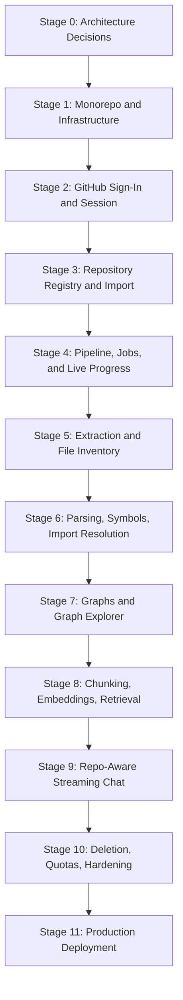

# AI Code Archaeologist — Development Stages

## Purpose

This document defines the build order for the product. Each stage has a goal, deliverables, and exit criteria, so the project moves from foundation to production-ready without mixing concerns.

It reflects the four-deployable architecture (`web`, `api`, `indexer`, `ai`) and GitHub-only authentication. See `adr/0001-four-deployables.md` and `adr/0002-github-only-auth.md`.

## Stage Flow Chart

## Stage 0: Architecture Decisions

### Goal

Settle the decisions that are expensive to change, before any application code.

### Deliverables

- `CODEBASE.md`, `RULES.md`, this document.
- `EVENT_CONTRACTS.md`, `API_ERROR_CODES.md`, `SCOPE_LIMITS.md`.
- `LLM_PROMPTING.md`, `DATA_RETENTION_AND_PRIVACY.md`.
- Module plan documents for every module.
- `adr/` entries for the four/eight split, GitHub-only auth, queue choice, migration tooling, and deferred tracing.

### Exit Criteria

- `repoId` ownership is unambiguous.
- The authorization model is written down.
- Every job name has a concrete payload schema.
- Every documented limit has a default value.
- Snapshot lifecycle and file-content storage are decided.

## Stage 1: Monorepo and Infrastructure

### Goal

A working local development environment and the shared plumbing every module depends on.

### Deliverables

- Root `package.json`, `pnpm-workspace.yaml`, `turbo.json`.
- Shared TypeScript, ESLint, and Prettier configuration.
- `docker-compose.yml` with PostgreSQL, Redis, and MinIO.
- Databases `aca_api`, `aca_indexer`, `aca_ai`, `aca_queue` created by an init script.
- dbmate wired per deployable.
- `packages/contracts`, `packages/config`, `packages/logger`, `packages/queue`, `packages/db`, `packages/eslint-config`, `packages/tsconfig`.
- Three NestJS/Fastify skeletons with health endpoints and one React/Vite app.
- CI workflow running install, lint, typecheck, test, build.

### Exit Criteria

- `pnpm install` succeeds from a clean checkout.
- `pnpm infra:up && pnpm db:migrate && pnpm dev` starts everything.
- All four `/health/ready` endpoints report dependency status truthfully.
- A trivial pg-boss job can be enqueued in `api` and consumed in `indexer`.
- CI is green.

## Stage 2: GitHub Sign-In and Session

### Goal

A user can sign in with GitHub and reach a protected page.

### Deliverables

- GitHub App registered; OAuth start and callback in `api`.
- `users`, `refresh_sessions` migrations.
- Encrypted GitHub token storage with `key_version`.
- JWT access tokens, rotating hashed refresh tokens, logout.
- Auth guard, `/auth/me`.
- Internal service token issuing and `InternalAuthGuard` in all three services.
- React sign-in page, auth provider, protected routes, 401-refresh interceptor.

### Exit Criteria

- A user can sign in with GitHub and see their profile.
- Protected routes reject unauthenticated requests.
- The browser never receives a GitHub token.
- Refresh tokens are stored hashed and rotate on every use.
- Internal endpoints reject requests without a valid internal token.
- Token encryption round-trips and supports a second key version.

## Stage 3: Repository Registry and Import

### Goal

A user can browse their GitHub repositories and import one.

### Deliverables

- `GET /api/v1/github/repositories` — live, paginated GitHub listing (not persisted).
- `indexer` `repositories` and `repository_snapshots` migrations.
- `POST /internal/repositories/import` returning the canonical `repoId`.
- Just-in-time GitHub token handoff from `api` to `indexer`.
- Repository size and count pre-checks against `SCOPE_LIMITS.md`.
- React repository list with private/public badge, search, and an Import action.

### Exit Criteria

- `repoId` is minted only by `indexer`.
- Importing the same repository twice does not create a duplicate.
- Oversized repositories are rejected at import with a clear message, before any work starts.
- Repository ownership is enforced on every repo-scoped route.
- GitHub rate-limit responses are handled without hammering the API.

## Stage 4: Pipeline, Jobs, and Live Progress

### Goal

The event-driven backbone, visible to the user.

### Deliverables

- pg-boss queues, envelope construction, retry policy, DLQ handling in `packages/queue`.
- Job payload Zod schemas for every job name.
- `processing_jobs` and `job_stage_events` migrations in `indexer`.
- Stage state machine with terminal-event semantics.
- `processed_events` idempotency table in all three databases.
- `GET /api/v1/repositories/:repoId/job` and the SSE progress stream with Redis fan-out.
- React processing-status view.

### Exit Criteria

- Import creates a job that advances through stages and persists every transition.
- Duplicate job delivery does not duplicate rows or double-advance a stage.
- A failed stage retries with backoff and lands in a DLQ after the retry limit.
- Progress reaches the browser with three `api` replicas running (fan-out is correct, not accidentally single-replica).
- A restarted `indexer` resumes from persisted state.

## Stage 5: Extraction and File Inventory

### Goal

Turn a snapshot archive into a durable, filtered file inventory plus per-file text in object storage.

### Deliverables

- Tarball download and S3 upload.
- Safe archive extraction with path normalization and traversal rejection.
- Ignore rules, binary detection, size limits, secret-file exclusion.
- Per-file text objects and `manifest.json` written to S3.
- `repository_files` migration with indexes.
- Temporary directory cleanup on success and failure.

### Exit Criteria

- The sample repository fixture produces a stable, asserted file inventory.
- A crafted archive containing `../` entries and escaping symlinks is rejected.
- `.env`, key, and certificate files never reach S3 or the database.
- Temporary directories are gone after both success and failure.
- Nothing large is ever placed in a job payload.

## Stage 6: Parsing, Symbols, Import Resolution

### Goal

Extract the facts the graphs are built from.

### Deliverables

- TypeScript/JavaScript parser using the TypeScript compiler API or `ts-morph`.
- Symbol extraction: classes, interfaces, functions, methods, exports, with line ranges.
- Import extraction covering ESM, CommonJS `require`, and dynamic `import()`.
- The documented import-resolution algorithm, including `tsconfig` `paths` and workspace packages.
- `code_symbols` and `file_dependencies` migrations with indexes and `resolution_status`.
- Line-window fallback path for unsupported languages.

### Exit Criteria

- The fixture's symbols and imports match asserted expectations.
- Relative, aliased, index-directory, workspace, and bare imports all resolve correctly.
- External packages become `external` edges; genuinely unresolvable imports are stored as `unresolved`, never dropped.
- Repository code is never executed and no dependencies are installed.
- Parsing runs off the main event loop and honours the processing timeout.

## Stage 7: Graphs and Graph Explorer

### Goal

Make the repository structure visible.

### Deliverables

- Folder, dependency, and symbol graph builders.
- `graph_nodes` and `graph_edges` migrations, with forward **and reverse** edge indexes.
- Graph query APIs with node caps, filtering, and neighbourhood expansion.
- Nested `/tree` endpoint for the file explorer.
- React Flow explorer: graph-type toggle, search, node detail panel, expand neighbours, fit view, filters.
- "Graph truncated" and "not available for this language" states.

### Exit Criteria

- All three graph types render for the fixture and for a real mid-sized TypeScript repository.
- A graph exceeding `GRAPH_QUERY_MAX_NODES` truncates predictably and says so.
- "Who imports this file?" is answered by an indexed reverse query, not a scan.
- Graph reads are scoped to the active snapshot only.
- Graph responses are cached by `snapshotId` and invalidate on cutover.

## Stage 8: Chunking, Embeddings, Retrieval

### Goal

A retrieval layer good enough for grounded answers.

### Deliverables

- `ai` reads the S3 manifest and per-file text.
- Symbol-aware chunking with line-window fallback.
- pgvector migration with an **HNSW** index.
- `code_chunks` keyed for cross-snapshot reuse by `(repo_id, content_hash)`, plus a `snapshot_chunks` link table.
- Embedding provider adapter with bounded concurrency and backoff.
- Hybrid retrieval: vector similarity plus lexical/metadata filters on path, language, and symbol name.
- Secret redaction and exclusion enforcement.

### Exit Criteria

- Chunks carry file path, line range, symbol name, and language.
- Re-indexing an unchanged repository performs **zero** new embedding calls.
- Re-indexing after a 3-file change embeds only those files' chunks.
- Retrieval returns citable chunks for file, class, and function questions.
- Excluded and secret-matching files are provably absent from `code_chunks`.

## Stage 9: Repo-Aware Streaming Chat

### Goal

The product's headline feature.

### Deliverables

- `chat_conversations` and `chat_messages` migrations.
- Retrieval integration and context assembly per `LLM_PROMPTING.md`.
- LLM provider adapter behind a `LLM_PROVIDER` setting.
- Server-sent token streaming through `api` to the browser.
- Citation extraction and storage.
- React chat UI: conversation list, composer, streamed Markdown, citation chips, file-context panel.

### Exit Criteria

- A user can ask a question and see tokens stream within two seconds.
- Every code claim cites a real file and line range that resolves in the file panel.
- Asking about something absent from the repository yields an explicit "not found in this repository", not an invention.
- Conversation ownership is enforced.
- Token usage is recorded per user and per message.

## Stage 10: Deletion, Quotas, Hardening

### Goal

Make the system trustworthy and affordable.

### Deliverables

- `DELETE /api/v1/repositories/:repoId` and account deletion.
- `repo.deleted` and `user.deleted` jobs with cleanup handlers in every deployable, plus S3 object removal.
- `snapshot.prune` scheduled job honouring retention.
- Per-user quotas and rate limits enforced before paid calls.
- Prometheus metrics, dashboards, alerts.
- Full test matrix including failure paths.
- Dependency and image scanning in CI.

### Exit Criteria

- Deleting a repository removes its rows from all databases and its objects from S3, verified by test.
- Exceeding a quota returns a clear, actionable error rather than a silent failure or a surprise bill.
- Queue depth, DLQ arrivals, and stalled jobs are visible and alerting.
- Unauthorized cross-user access is covered by tests.

## Stage 11: Production Deployment

### Goal

Ship it.

### Deliverables

- Production Dockerfile and `.env.example` per deployable.
- Migration step separated from application start.
- Deployment manifests or platform configuration.
- Readiness gating, graceful shutdown, resource limits.
- PostgreSQL backup and restore procedure, tested.
- S3 lifecycle policy.
- Runbook for common failures.

### Exit Criteria

- Each deployable builds as its own image, tagged by commit SHA.
- Each deploys independently.
- Migrations run as a separate step.
- Services recover after restart with no manual repair.
- No durable state depends on local disk.
- No production secret lives in the repository.

## Milestones

| Milestone | Stages | User-visible outcome |
| --- | --- | --- |
| M1 — Sign in and browse | 1–3 | Sign in with GitHub, see repositories, import one |
| M2 — Indexing works | 4–6 | Watch a repository index and see its file and symbol inventory |
| M3 — Graph explorer | 7 | Explore folder, dependency, and symbol graphs |
| M4 — Repo chat | 8–9 | Ask questions and get cited, streamed answers |
| M5 — Production MVP | 10–11 | Secure, observable, deletable, deployable |

## Parallelisation

With the four-deployable split, some work can run concurrently once Stage 4 lands:

- Stages 5–7 (`indexer`) and Stage 8 (`ai`) share only the S3 manifest contract. Build `ai` against a hand-written manifest for the fixture while `indexer` work continues.
- Web work for each milestone can start as soon as the relevant contract exists in `packages/contracts`, using mocked handlers.

## Development Rule

Do not start the next stage until the current stage has working code, migrations, tests, and a usable UI path where applicable.

Add one more rule to that: **do not build a stage against GitHub.** Every stage from 4 onward must be exercisable against the checked-in sample repository fixture, entering the pipeline at `repo.snapshot.created`. This keeps stages 4–9 unblocked by OAuth setup and gives the test suite something deterministic to assert against.
