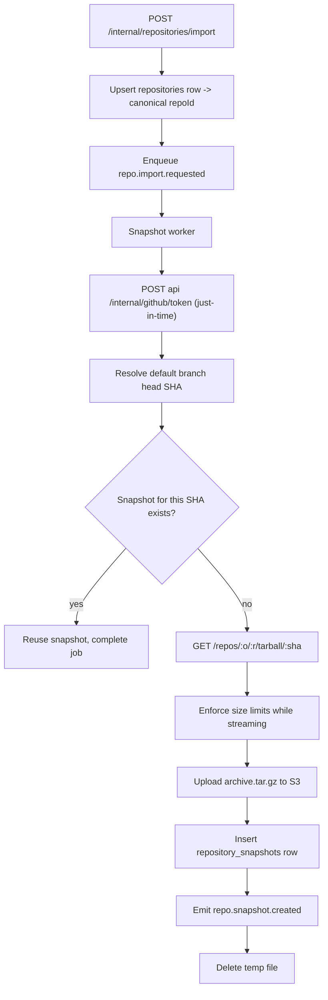

# Indexer Service — Repositories and Snapshots Module

> **Deployable:** `indexer` (`@aca/indexer`) · **Port:** 3100 · **Database:** `aca_indexer`
> **Sibling modules:** Pipeline, Parser, Graph

## Purpose

This module owns **repository identity** and repository snapshots. It mints the canonical `repoId`, resolves commit SHAs, downloads repository tarballs from GitHub, stores archives in object storage, and manages the snapshot lifecycle.

It does **not** store GitHub tokens. It requests one from `api` per job and holds it in memory for the duration of a single download.

## Flow Chart



## Responsibilities

- Mint and own `repoId` (`repositories.id`).
- Enforce repository-count and size quotas at import time.
- Resolve the default branch and head commit SHA.
- Download repository tarballs, streaming, with size enforcement.
- Upload archives to object storage.
- Create, activate, retain, and prune snapshots.
- Serve repository metadata to `api`.
- Handle repository deletion.

## Repository Identity

> `repoId` is `aca_indexer.repositories.id`. Nothing else may mint it.

`api` lists a user's GitHub repositories live and does not persist them. On import it calls this module, which upserts on `(owner_user_id, provider, provider_repo_id)` and returns the canonical `repoId`. Every downstream table and job payload uses that value.

## Snapshot Lifecycle

- `repositories.active_snapshot_id` is what the UI, graphs, and chat read.
- Cutover happens in one transaction when the Pipeline module records `repo.processing.completed`.
- Re-import at an unchanged SHA is a no-op returning the existing snapshot.
- `SNAPSHOT_RETENTION_COUNT` (default 2) snapshots are kept; older ones are removed by the scheduled `snapshot.prune` job, which deletes rows in `indexer` and `ai` and the corresponding S3 prefixes.
- Snapshot statuses: `pending` → `downloading` → `stored` → `active` → `superseded` | `failed`.

**Reason this is explicit:** with no active-snapshot pointer, a second import silently doubles storage and lets graphs and chat read a mix of two versions of the code.

## Object Storage Layout

```text
s3://{S3_BUCKET_SNAPSHOTS}/{repoId}/{snapshotId}/archive.tar.gz
s3://{S3_BUCKET_SNAPSHOTS}/{repoId}/{snapshotId}/manifest.json
s3://{S3_BUCKET_SNAPSHOTS}/{repoId}/{snapshotId}/files/{fileId}
```

The Parser module writes `manifest.json` and the per-file text objects; this module owns the prefix and its deletion.

## APIs

```text
POST   /internal/repositories/import
GET    /internal/repositories/:repoId
GET    /internal/repositories?userId=
DELETE /internal/repositories/:repoId
POST   /internal/repositories/:repoId/reindex
GET    /internal/repositories/:repoId/ownership?userId=
GET    /internal/files/:fileId/content?startLine=&endLine=
GET    /health/live
GET    /health/ready
```

All routes are internal and require a valid internal service token. `api` is the only caller.

`GET /internal/repositories/:repoId/ownership` is what backs the Gateway's 60-second ownership cache.

## Jobs

**Consumed:** `repo.import.requested`, `repo.deleted`, `user.deleted`, `snapshot.prune`
**Published:** `repo.snapshot.created`, `repo.stage.failed`

## Database Ownership

```text
services/indexer/migrations/
  001_create_repositories.sql
  002_create_repository_snapshots.sql
```

```sql
CREATE TABLE IF NOT EXISTS repositories (
  id                  uuid PRIMARY KEY,
  owner_user_id       uuid NOT NULL,
  provider            text NOT NULL DEFAULT 'github',
  provider_repo_id    text NOT NULL,
  full_name           text NOT NULL,
  default_branch      text NOT NULL,
  is_private          boolean NOT NULL DEFAULT false,
  primary_language    text,
  active_snapshot_id  uuid,
  metadata            jsonb NOT NULL DEFAULT '{}'::jsonb,
  deleted_at          timestamptz,
  created_at          timestamptz NOT NULL DEFAULT now(),
  updated_at          timestamptz NOT NULL DEFAULT now(),
  UNIQUE (owner_user_id, provider, provider_repo_id)
);

CREATE INDEX IF NOT EXISTS idx_repositories_owner
  ON repositories (owner_user_id, updated_at DESC) WHERE deleted_at IS NULL;

CREATE TABLE IF NOT EXISTS repository_snapshots (
  id             uuid PRIMARY KEY,
  repo_id        uuid NOT NULL REFERENCES repositories(id) ON DELETE CASCADE,
  commit_sha     text NOT NULL,
  ref            text NOT NULL,
  archive_key    text,
  manifest_key   text,
  size_bytes     bigint,
  file_count     integer,
  status         text NOT NULL,
  error_code     text,
  created_at     timestamptz NOT NULL DEFAULT now(),
  updated_at     timestamptz NOT NULL DEFAULT now(),
  UNIQUE (repo_id, commit_sha)
);

CREATE INDEX IF NOT EXISTS idx_snapshots_repo_created
  ON repository_snapshots (repo_id, created_at DESC);

ALTER TABLE repositories
  ADD CONSTRAINT fk_repositories_active_snapshot
  FOREIGN KEY (active_snapshot_id) REFERENCES repository_snapshots(id) ON DELETE SET NULL;
```

## GitHub Access

- Use the **tarball endpoint** (`GET /repos/{owner}/{repo}/tarball/{sha}`), not `git clone`: no git binary in the image, no `.git` history to strip, far less bandwidth and disk.
- Stream to a temporary file, aborting the moment `MAX_REPOSITORY_ARCHIVE_MB` is exceeded — do not download first and check after.
- Respect primary **and secondary** rate limits: honour `Retry-After`, back off on abuse-detection responses, never retry tightly.
- On a `GITHUB_RECONNECT_REQUIRED` response from `api`, fail the job as non-retryable with a user-facing reconnect prompt.

## Environment Variables

```text
NODE_ENV
PORT=3100
DATABASE_URL                        # aca_indexer
QUEUE_DATABASE_URL                  # aca_queue
REDIS_URL
API_SERVICE_URL
INTERNAL_JWT_SECRET
GITHUB_API_BASE_URL=https://api.github.com
S3_ENDPOINT
S3_REGION
S3_ACCESS_KEY_ID
S3_SECRET_ACCESS_KEY
S3_BUCKET_SNAPSHOTS
MAX_REPOSITORY_ARCHIVE_MB=500
MAX_REPOSITORIES_PER_USER=10
SNAPSHOT_RETENTION_COUNT=2
TEMP_WORK_DIR=/tmp/aca
DOWNLOAD_TIMEOUT_SECONDS=600
```

## Security

- Verify the requesting user has GitHub access to the repository before creating a snapshot.
- Request a GitHub token per job; never persist it, never log it.
- Enforce quotas before starting work, not partway through.
- Delete temporary files on success and on failure, in a `finally` block.
- Treat the archive as untrusted; extraction safety is the Parser module's responsibility and is specified there.

## Deletion

`repo.deleted` handler, in order:

1. Mark `repositories.deleted_at`, detach `active_snapshot_id`.
2. Delete graph nodes/edges, symbols, dependencies, files for all snapshots of the repo.
3. Publish the same job to `ai` for chunk, embedding, conversation, and message removal.
4. Delete the S3 prefix `{repoId}/`.
5. Delete snapshot and repository rows.

`user.deleted` iterates the user's repositories and runs the same path for each.

## Testing

- Import upserts and returns a stable `repoId` across repeated calls.
- Re-import at an unchanged SHA reuses the snapshot and performs no download.
- Oversized archives abort mid-stream and fail with `REPO_TOO_LARGE`.
- Rate-limit responses back off correctly.
- Snapshot cutover is atomic under concurrent reads.
- Pruning removes rows and S3 objects for retained-count overflow only.
- Deletion removes everything, verified across `aca_indexer`, `aca_ai`, and S3.

## Implementation Steps

1. Migrations for `repositories` and `repository_snapshots`.
2. Import endpoint with quota checks and upsert semantics.
3. Just-in-time GitHub token client against `api`.
4. Head-SHA resolution and snapshot deduplication.
5. Streaming tarball download with size enforcement and S3 upload.
6. Emit `repo.snapshot.created`; guarantee temp cleanup.
7. Active-snapshot cutover, retention, and the `snapshot.prune` job.
8. Deletion handlers for `repo.deleted` and `user.deleted`.
