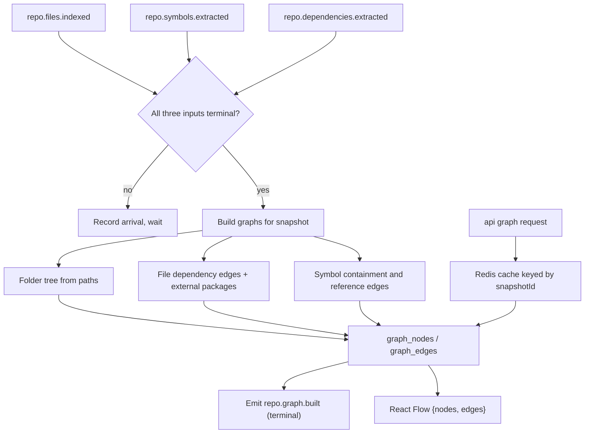

# Indexer Service — Graph Module

> **Deployable:** `indexer` (`@aca/indexer`) · **Port:** 3100 · **Database:** `aca_indexer`
> **Sibling modules:** Repositories & Snapshots, Pipeline, Parser

## Purpose

The Graph module builds and serves the three graphs the product is named for: folder structure, file dependencies, and symbol relationships. It reads facts the Parser module produced and materializes nodes and edges shaped for the React Flow canvas.

## Flow Chart



## Build trigger — stated explicitly

Graph building needs all three parser outputs. Since they arrive independently, the module records terminal-event arrival per snapshot in `graph_build_state` and builds **only when all three are present**. Duplicate arrivals are absorbed by `processed_events`.

Without this the module would build a folder graph three times and a dependency graph from incomplete data.

## Responsibilities

- Build folder, dependency, and symbol graphs per snapshot.
- Represent external packages as terminal nodes.
- Serve graph queries with node caps, filters, and neighbourhood expansion.
- Serve the nested `/tree` shape for the file explorer.
- Cache hot responses by `snapshotId`.

## Graph Types

| Type | Nodes | Edges |
| --- | --- | --- |
| `folder` | `directory`, `file` | `contains` |
| `dependency` | `file`, `external_package` | `imports`, `imports_type`, `requires`, `imports_dynamic` |
| `symbol` | `class`, `interface`, `function`, `method`, `type`, `enum` | `declares`, `extends`, `implements`, `member_of` |

The `module` graph type from the original plan is dropped: it was defined as "package-level grouping where possible", had no consumer in the UI, and no build rule. Add it when a screen needs it.

`weight` is likewise dropped from edges — nothing in v1 produces or reads a weight, and an always-`1` column invites people to invent meanings for it.

## Stateless Design

- All graph state is in `aca_indexer`.
- Build workers are queue-driven and idempotent.
- Redis caching is an optimization only; correctness never depends on it.
- Cache keys include `snapshotId`, so snapshot cutover invalidates naturally without an explicit purge.

## APIs

```text
GET /internal/repositories/:repoId/tree?path=&depth=
GET /internal/repositories/:repoId/graph/folders?rootPath=&maxNodes=
GET /internal/repositories/:repoId/graph/dependencies?scopePath=&includeExternal=&maxNodes=
GET /internal/repositories/:repoId/graph/symbols?filePath=&symbolType=&maxNodes=
GET /internal/repositories/:repoId/graph/nodes/:nodeId/neighbors?direction=&depth=&maxNodes=
GET /internal/repositories/:repoId/graph/search?q=&types=
GET /health/live
GET /health/ready
```

`direction` is `in` | `out` | `both`. `in` answers "who imports this file?", which is served by the reverse index on `graph_edges(target_node_id, edge_type)`.

All graph reads are scoped to the repository's **active snapshot** unless an explicit `snapshotId` is supplied by an internal caller.

### `/tree` vs `/graph/folders`

Both exist, over the same data, deliberately:

- `/tree` returns a **nested** structure with lazy children, for the file explorer sidebar.
- `/graph/folders` returns **flat** `{nodes, edges}` positioned for the React Flow canvas.

They must not be implemented in terms of each other — deriving one from the other produces either a slow explorer or an awkward canvas. Two shapes, one source of truth in the database.

## Node Caps and Truncation

Real repositories exceed what a canvas can render. Every graph response obeys `GRAPH_QUERY_MAX_NODES` (default 1500) and returns:

```json
{
  "nodes": [],
  "edges": [],
  "truncated": true,
  "totalNodes": 8241,
  "returnedNodes": 1500,
  "strategy": "top-degree",
  "hint": "Filter by folder or expand from a node to see more."
}
```

Selection strategy when truncating: highest-degree nodes first, always including the requested root and its direct neighbours. The UI must show the truncation state rather than silently rendering a partial graph.

## Jobs

**Consumed:** `repo.files.indexed`, `repo.symbols.extracted`, `repo.dependencies.extracted`
**Published:** `repo.graph.built`, `repo.stage.failed`

## Database Ownership

```text
services/indexer/migrations/
  030_create_graph_nodes.sql
  031_create_graph_edges.sql
  032_create_graph_build_state.sql
```

```sql
CREATE TABLE IF NOT EXISTS graph_nodes (
  id           uuid PRIMARY KEY,
  repo_id      uuid NOT NULL,
  snapshot_id  uuid NOT NULL,
  graph_type   text NOT NULL,   -- folder | dependency | symbol
  node_type    text NOT NULL,   -- directory | file | external_package | class | function | ...
  label        text NOT NULL,
  path         text,
  ref_id       uuid,            -- repository_files.id or code_symbols.id
  degree       integer NOT NULL DEFAULT 0,
  metadata     jsonb NOT NULL DEFAULT '{}'::jsonb,
  created_at   timestamptz NOT NULL DEFAULT now(),
  UNIQUE (snapshot_id, graph_type, node_type, label, path)
);

CREATE INDEX IF NOT EXISTS idx_graph_nodes_repo_snapshot_type
  ON graph_nodes (repo_id, snapshot_id, graph_type, node_type);
CREATE INDEX IF NOT EXISTS idx_graph_nodes_degree
  ON graph_nodes (snapshot_id, graph_type, degree DESC);
CREATE INDEX IF NOT EXISTS idx_graph_nodes_label_search
  ON graph_nodes (snapshot_id, lower(label));

CREATE TABLE IF NOT EXISTS graph_edges (
  id              uuid PRIMARY KEY,
  repo_id         uuid NOT NULL,
  snapshot_id     uuid NOT NULL,
  graph_type      text NOT NULL,
  source_node_id  uuid NOT NULL REFERENCES graph_nodes(id) ON DELETE CASCADE,
  target_node_id  uuid NOT NULL REFERENCES graph_nodes(id) ON DELETE CASCADE,
  edge_type       text NOT NULL,
  metadata        jsonb NOT NULL DEFAULT '{}'::jsonb,
  created_at      timestamptz NOT NULL DEFAULT now(),
  UNIQUE (snapshot_id, source_node_id, target_node_id, edge_type)
);

CREATE INDEX IF NOT EXISTS idx_graph_edges_source
  ON graph_edges (source_node_id, edge_type);
CREATE INDEX IF NOT EXISTS idx_graph_edges_target
  ON graph_edges (target_node_id, edge_type);
CREATE INDEX IF NOT EXISTS idx_graph_edges_repo_snapshot_type
  ON graph_edges (repo_id, snapshot_id, graph_type);

CREATE TABLE IF NOT EXISTS graph_build_state (
  snapshot_id       uuid PRIMARY KEY,
  repo_id           uuid NOT NULL,
  files_ready       boolean NOT NULL DEFAULT false,
  symbols_ready     boolean NOT NULL DEFAULT false,
  dependencies_ready boolean NOT NULL DEFAULT false,
  built_at          timestamptz,
  updated_at        timestamptz NOT NULL DEFAULT now()
);
```

`degree` is materialized at build time so truncation can pick important nodes without an aggregate query per request.

## UI Response Shape

```json
{
  "graphType": "dependency",
  "snapshotId": "uuid",
  "nodes": [
    {
      "id": "uuid",
      "type": "file",
      "label": "src/app.ts",
      "path": "src/app.ts",
      "metadata": { "language": "typescript", "degree": 14, "refId": "uuid" }
    },
    {
      "id": "uuid",
      "type": "external_package",
      "label": "react",
      "metadata": { "degree": 41 }
    }
  ],
  "edges": [
    { "id": "uuid", "source": "uuid", "target": "uuid", "type": "imports" }
  ],
  "truncated": false,
  "totalNodes": 312,
  "returnedNodes": 312
}
```

Layout positions are computed client-side by React Flow; the server never returns coordinates.

## Environment Variables

```text
NODE_ENV
PORT=3100
DATABASE_URL
QUEUE_DATABASE_URL
REDIS_URL
GRAPH_QUERY_MAX_NODES=1500
GRAPH_NEIGHBOR_MAX_DEPTH=3
GRAPH_CACHE_TTL_SECONDS=300
GRAPH_BUILD_BATCH_SIZE=2000
```

## Testing

- Folder graph from a known path set, including deep nesting and files at root.
- Dependency edges for each resolution status; `external` becomes an `external_package` node; `unresolved` is visible, not dropped.
- Symbol containment (`method` → `class`) and inheritance edges.
- Build fires exactly once, after all three terminal inputs, regardless of arrival order.
- Duplicate input events do not duplicate nodes or edges (unique constraints hold).
- Truncation returns a stable, useful subgraph and reports `truncated: true`.
- Reverse neighbour query uses the index — assert with `EXPLAIN` in a test.
- Cache invalidates on snapshot cutover.
- Response validates against the React Flow contract schema.

## Implementation Steps

1. Node and edge contracts in `packages/contracts`.
2. Migrations, including reverse edge index and `graph_build_state`.
3. Arrival tracking and the all-three-ready build trigger.
4. Folder tree builder from file paths.
5. Dependency graph builder, including external package nodes.
6. Symbol graph builder with containment and inheritance.
7. Degree materialization.
8. Query endpoints with caps, filters, truncation metadata, and neighbourhood expansion.
9. Redis caching keyed by `snapshotId`.
