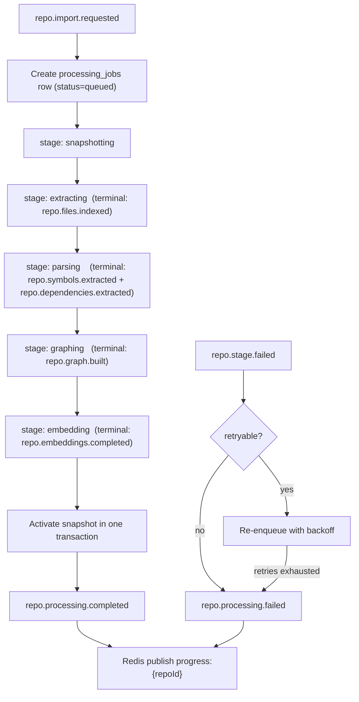

# Indexer Service — Pipeline Module

> **Deployable:** `indexer` (`@aca/indexer`) · **Port:** 3100 · **Database:** `aca_indexer`
> **Sibling modules:** Repositories & Snapshots, Parser, Graph

## Purpose

The Pipeline module owns indexing job state: the stage machine, progress, retries, failure classification, and the progress feed the browser sees. It is the single authority on "is this repository ready".

## Flow Chart



## Stage Machine

```text
queued -> snapshotting -> extracting -> parsing -> graphing -> embedding -> completed
                                                                         \-> failed
                                                                         \-> cancelled
```

Progress percentages are fixed per stage boundary and interpolated within a stage using `itemsProcessed / totalItems`. No stage reports a percentage it cannot substantiate.

| Stage | Range |
| --- | --- |
| snapshotting | 0–10% |
| extracting | 10–30% |
| parsing | 30–60% |
| graphing | 60–75% |
| embedding | 75–99% |
| completed | 100% |

## Terminal-event semantics — required

Large repositories produce batched work. A stage may emit many progress events, so:

- Every stage event carries `{ stage, batchIndex, batchCount, itemsProcessed, totalItems }`.
- The pipeline advances **only** when `batchIndex === batchCount - 1`.
- Non-terminal events update progress and nothing else.

**Reason:** without this, the job marks itself complete on the first batch, the UI unlocks a half-built graph, and chat answers from a partially embedded repository. This is the most likely silent correctness bug in the pipeline.

## Failure ownership

- Workers publish `repo.stage.failed` with `{ stage, errorCode, retryable, detail }`.
- Only this module publishes the terminal `repo.processing.failed`.

**Reason:** in the original design, four services published `repo.processing.failed` while the orchestrator both consumed and published it — meaning it could consume its own failure event. Splitting worker failures from terminal failures removes the loop and makes "who decides a job is dead" unambiguous.

## Responsibilities

- Create and advance processing jobs.
- Persist every stage transition with timing.
- Classify failures and retry only retryable, idempotent stages.
- Publish progress to Redis `progress:{repoId}` for Gateway fan-out.
- Trigger the atomic active-snapshot cutover on completion.
- Serve the latest job state to `api`.
- Support cancellation and manual retry.

## Stateless Design

- All job state lives in `aca_indexer`.
- Redis holds only advisory locks and the transient progress channel.
- Handlers are idempotent via `processed_events`.
- A restarted instance resumes from persisted state; pg-boss redelivers in-flight jobs after their visibility timeout.

## APIs

```text
GET  /internal/jobs/:jobId
GET  /internal/repositories/:repoId/job          (latest)
POST /internal/jobs/:jobId/retry
POST /internal/jobs/:jobId/cancel
GET  /health/live
GET  /health/ready
```

## Jobs

**Consumed:** `repo.import.requested`, `repo.snapshot.created`, `repo.files.indexed`, `repo.symbols.extracted`, `repo.dependencies.extracted`, `repo.graph.built`, `repo.embeddings.completed`, `repo.stage.failed`

**Published:** `repo.processing.completed`, `repo.processing.failed`, plus the next stage's work job

## Database Ownership

```text
services/indexer/migrations/
  010_create_processing_jobs.sql
  011_create_job_stage_events.sql
  012_create_processed_events.sql
```

```sql
CREATE TABLE IF NOT EXISTS processing_jobs (
  id                uuid PRIMARY KEY,
  repo_id           uuid NOT NULL REFERENCES repositories(id) ON DELETE CASCADE,
  snapshot_id       uuid REFERENCES repository_snapshots(id) ON DELETE SET NULL,
  requested_by      uuid NOT NULL,
  status            text NOT NULL,
  current_stage     text NOT NULL,
  progress_percent  integer NOT NULL DEFAULT 0,
  retry_count       integer NOT NULL DEFAULT 0,
  error_code        text,
  error_message     text,
  correlation_id    uuid NOT NULL,
  started_at        timestamptz,
  completed_at      timestamptz,
  created_at        timestamptz NOT NULL DEFAULT now(),
  updated_at        timestamptz NOT NULL DEFAULT now()
);

CREATE INDEX IF NOT EXISTS idx_processing_jobs_repo_created
  ON processing_jobs (repo_id, created_at DESC);

CREATE UNIQUE INDEX IF NOT EXISTS uq_processing_jobs_active_per_repo
  ON processing_jobs (repo_id)
  WHERE status IN ('queued','running');

CREATE TABLE IF NOT EXISTS job_stage_events (
  id              uuid PRIMARY KEY,
  job_id          uuid NOT NULL REFERENCES processing_jobs(id) ON DELETE CASCADE,
  stage           text NOT NULL,
  event_type      text NOT NULL,
  items_processed integer,
  total_items     integer,
  duration_ms     integer,
  payload         jsonb NOT NULL DEFAULT '{}'::jsonb,
  created_at      timestamptz NOT NULL DEFAULT now()
);

CREATE INDEX IF NOT EXISTS idx_job_stage_events_job_created
  ON job_stage_events (job_id, created_at ASC);

CREATE TABLE IF NOT EXISTS processed_events (
  event_id     uuid NOT NULL,
  consumer     text NOT NULL,
  processed_at timestamptz NOT NULL DEFAULT now(),
  PRIMARY KEY (event_id, consumer)
);
```

`uq_processing_jobs_active_per_repo` is a partial unique index that makes "one active job per repository" a database guarantee rather than an application convention. It is the cheapest possible defence against duplicate imports racing.

`job_stage_events` is kept — it backs the user-visible indexing timeline and is genuinely useful for debugging a stuck stage. It is pruned with its parent job by a retention job (`JOB_EVENT_RETENTION_DAYS`, default 30).

## Progress Publishing

On every state change:

```json
{
  "repoId": "uuid",
  "jobId": "uuid",
  "status": "running",
  "stage": "parsing",
  "progressPercent": 42,
  "message": "Parsed 812 of 1,940 files",
  "errorCode": null,
  "occurredAt": "2026-08-19T10:31:02.140Z"
}
```

Published to Redis channel `progress:{repoId}`. `api` replicas subscribe and forward over SSE. The Gateway must not consume this from the queue — see the reasoning in `API_GATEWAY_SERVICE_PLAN.md`.

## Environment Variables

```text
NODE_ENV
PORT=3100
DATABASE_URL
QUEUE_DATABASE_URL
REDIS_URL
JOB_LOCK_TTL_SECONDS=300
MAX_RETRY_COUNT=3
RETRY_BACKOFF_BASE_SECONDS=30
STAGE_TIMEOUT_SECONDS=1800
STALLED_JOB_SWEEP_SECONDS=60
JOB_EVENT_RETENTION_DAYS=30
```

## Stalled Job Handling

A sweeper runs every `STALLED_JOB_SWEEP_SECONDS` and fails any job whose `updated_at` is older than `STAGE_TIMEOUT_SECONDS` with `STAGE_TIMEOUT`, marking it retryable once. Without this, a worker killed mid-stage leaves a job running forever and the UI spins indefinitely.

## Testing

- Every stage transition, in order, and rejection of out-of-order transitions.
- Duplicate delivery of every job type does not double-advance or duplicate rows.
- Non-terminal batch events update progress but never advance the stage.
- Retryable failures retry with backoff; non-retryable fail immediately.
- Retries exhausted lands in DLQ and marks the job failed.
- Concurrent imports for one repository: exactly one job survives (partial unique index).
- Stalled-job sweeper fails a job whose worker vanished.
- Snapshot activation is atomic and only happens on completion.

## Implementation Steps

1. Define the stage machine as data, with allowed transitions asserted in code.
2. Migrations, including the partial unique index.
3. `packages/queue` handler wrapper providing idempotency and envelope validation.
4. Stage handlers, advancing only on terminal events.
5. Redis progress publisher.
6. Failure classification, retry with backoff, DLQ handling.
7. Atomic snapshot activation on completion.
8. Stalled-job sweeper, cancel, and manual retry endpoints.
