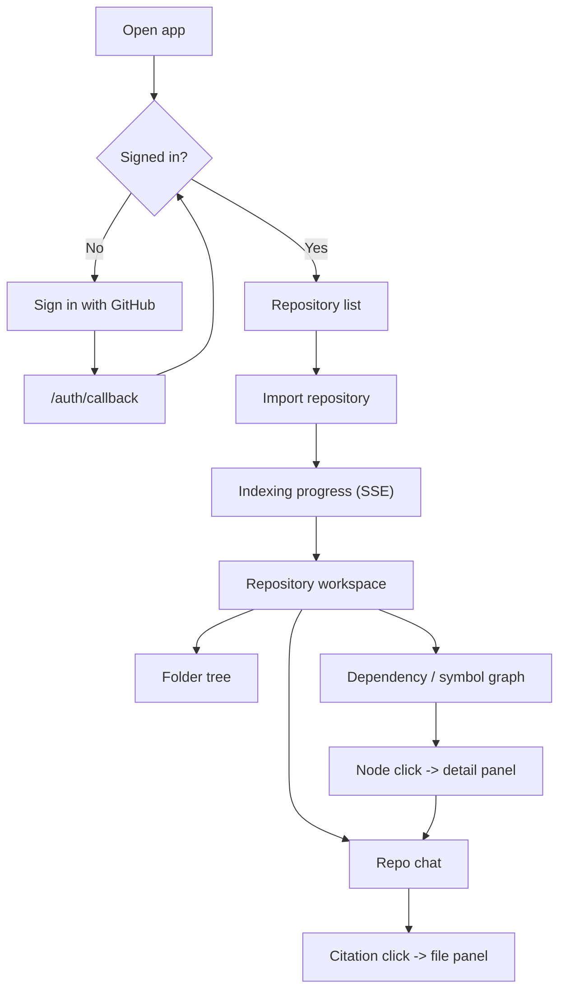

# Web App Plan

> **Deployable:** `web` (`@aca/web`) · Vite dev server on 5173 · Static assets in production

## Purpose

The web app gives users the complete product experience: sign in with GitHub, pick and import a repository, watch it index, explore its graphs, and ask grounded questions with clickable citations.

## Flow Chart



## App Structure

```text
apps/web/
  src/
    app/
      routes.tsx
      providers.tsx
      auth-guard.tsx
    features/
      auth/
      repositories/
      indexing/
      graph/
      chat/
      files/
    shared/
      api/
      components/
      hooks/
      styles/
      types/
```

## Routes

```text
/login
/auth/callback
/repositories
/repositories/:repoId                 -> overview
/repositories/:repoId/tree
/repositories/:repoId/graph
/repositories/:repoId/chat
/repositories/:repoId/chat/:conversationId
/settings
```

There is no `/register` route — sign-in is GitHub OAuth only.

## Screens

### Sign In

- A single "Continue with GitHub" action that hits `GET /api/v1/auth/github/start`.
- The callback route reads the outcome, refreshes the session, and redirects to the intended destination.
- Errors arrive as `?error=CODE` and map to human sentences from `API_ERROR_CODES.md`.

### Repository List

- Live GitHub repositories, cursor-paginated, with search and a private/public badge.
- Already-imported repositories are marked, with their indexing status and last indexed commit.
- Import action, disabled with an explanation when a quota or size limit would block it.
- Empty state when the GitHub App has no repository access, linking to the installation settings.

### Indexing Progress

- Subscribes to `GET /api/v1/repositories/:repoId/events` via `EventSource`.
- Shows the stage name, an honest percentage, and a per-stage timeline from `job_stage_events`.
- Automatic reconnection with `Last-Event-ID`; falls back to polling `/job` if SSE fails twice.
- Failure state shows the error code, a plain-language explanation, and a retry action.
- The workspace tabs stay locked until the job completes.

### Repository Workspace

Tabs: Overview · Folder Tree · Dependency Graph · Symbol Graph · Chat.

Overview shows the indexed commit, file and symbol counts, language breakdown, skipped-file count with reasons, and a re-index action.

### Folder Tree

- Nested, lazily expanded from `/tree`, virtualized for large repositories.
- Clicking a file opens the file panel with syntax-highlighted content.

### Graph Explorer

React Flow, with:

- graph-type toggle (folders / dependencies / symbols);
- search by file, class, or function name;
- node click → detail panel with metadata and an "Ask about this" action that seeds a chat message;
- expand neighbours, with direction control so "who imports this?" is one click;
- filters by node and edge type, and a toggle for external packages;
- fit-to-screen, zoom, and minimap.

Two states that must be built, not skipped:

- **Truncated:** when the response has `truncated: true`, show how many nodes were omitted and offer to filter by folder.
- **Unavailable:** when the repository's language has no parser, explain that dependency and symbol graphs are TypeScript/JavaScript only, and keep the folder graph working.

### Chat

- Conversation list per repository.
- Composer with suggested starter questions derived from the repository (largest files, entry points).
- **Streamed** answers rendered as Markdown as tokens arrive — no blocking spinner.
- Citation chips showing `path:startLine-endLine`; clicking opens the file panel scrolled to the range and highlighted.
- "Grounded in commit `abc1234`" note on each answer.
- Explicit rendering when the assistant reports missing evidence, so it reads as an honest answer rather than a failure.
- Stop-generation control.

### File Panel

- Fetches `/files/:fileId/content` with a line range, highlights the cited span.
- Shows the file's symbols and its importers, both linking back into the graph.

## API Client Strategy

- TanStack Query for all server state, with query keys namespaced by `repoId` and `snapshotId`.
- Types imported from `packages/contracts` — never hand-written.
- All calls centralized in `src/shared/api`.
- Access token held in memory; refresh via an `HttpOnly` cookie.
- A single 401 retry through `/auth/refresh`, with a shared in-flight promise so concurrent 401s trigger one refresh, not many.
- Errors surfaced through a typed error object carrying `code` and `correlationId`; the correlation ID is shown in the error UI so a user can quote it in a bug report.

## State Management

- Server data: TanStack Query.
- Route and view state: React Router and URL search params (graph type, filters, selected node) so views are shareable and survive reload.
- Ephemeral UI state: component-local `useState`.

**No global state library in v1.** The original plan included Zustand; with Query owning server state and the URL owning view state, the remaining global state is the auth session, which a small context provides. Adding a store before there is state that needs one is exactly the premature abstraction the engineering rules warn against. Add it the moment a real cross-tree, non-server, non-URL state need appears.

## Performance

- Route-level code splitting; React Flow and the syntax highlighter are lazily loaded.
- Virtualized file tree and conversation list.
- Graph node cap enforced server-side and respected client-side; nodes are memoized and edges rendered with a lightweight type.
- Debounced graph search.
- `EventSource` connections are closed on unmount — a leaked SSE connection per navigation is the most likely resource bug in this app.

## Accessibility

- Keyboard navigation for the tree, conversation list, and graph node selection.
- Visible focus states and adequate contrast in both themes.
- Live region announcing indexing status changes.
- The graph canvas has a text alternative: the same relationships available as a list.

## Environment Variables

```text
VITE_API_BASE_URL
VITE_APP_NAME
VITE_SENTRY_DSN            # optional
```

No `VITE_WS_BASE_URL` — progress uses SSE over the same origin as the API, so there is no second base URL to configure.

## Security

- No tokens in `localStorage`; the access token stays in memory and the refresh token in an `HttpOnly` cookie.
- GitHub tokens never reach the browser.
- Markdown is sanitized; raw HTML from model output is never rendered.
- Code blocks are rendered as text, never evaluated.
- Protected routes redirect to `/login` preserving the intended destination.
- A strict Content Security Policy served with the static assets.

## Testing

- Component tests for sign-in, repository list, indexing progress, graph explorer, and chat.
- Graph rendering tests with mocked graph payloads, including the truncated and unavailable states.
- Chat streaming test with a mocked `EventSource`.
- Citation click scrolls and highlights the correct range.
- 401 refresh-once behaviour, including concurrent requests.
- End-to-end happy path against the sample repository fixture with a stubbed GitHub provider.

## Docker and Deployment

- Built as static assets with Vite, served by Nginx or a static host.
- Independently deployable from the backend.
- Runtime configuration is baked at build time per environment.
- Long-lived cache headers on hashed assets; `index.html` never cached.

## Implementation Steps

1. Vite React TypeScript app, routing, providers, auth guard.
2. API client with contract types, refresh interceptor, typed errors.
3. Sign-in and callback screens.
4. Repository list with import, quotas, and empty states.
5. Indexing progress with SSE, reconnection, and polling fallback.
6. Folder tree and file panel.
7. Graph explorer with React Flow, including truncated and unavailable states.
8. Chat with streaming, citations, and file-panel integration.
9. Accessibility pass, performance pass, tests, production build.
