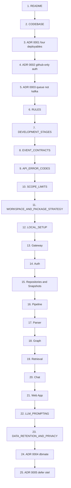

# Reading Order

There are 25 documents in this project. Read in this order and each one builds on the last. Read alphabetically and you will hit the parser plan before you know what a snapshot is.

A few of these are lookup tables rather than prose — read them once so you know what is in them, then consult as needed. They are marked **reference**.

---

## Shortcuts

| If you have… | Read |
| --- | --- |
| 30 minutes | README → CODEBASE → DEVELOPMENT_STAGES |
| A day before coding | Pass 1 and Pass 2 |
| A specific module to build | Pass 1, then that module's plan from Pass 3 |
| A new person joining | Pass 1, then only their module's plan |

---

## Pass 1 — Orientation

**Goal:** understand the system well enough to argue with it. Roughly 45 minutes.

### 1. `README.md`

What the product does, the four deployables, and the six decisions worth knowing before anything else. Five minutes.

### 2. `CODEBASE.md`

**The master document.** Architecture, service ownership, the canonical `repoId`, the authorization model, the indexing pipeline, snapshot lifecycle, file content storage, import resolution, language degradation, monorepo layout, security, and observability.

Every other document elaborates on some section of this one. Read it slowly — it is the only document where re-reading a paragraph is likely to be worth it.

Pay particular attention to:

- **Repository Identity** — why `repoId` has exactly one owner
- **Authorization Model** — why `indexer` and `ai` tables carry no `user_id`
- **Snapshot Lifecycle** — why there is one active snapshot
- **File Content Storage** — how source text reaches the AI service and the citation panel

### 3. `adr/0001-four-deployables.md`

Why eight microservices became four deployables, and why the module boundaries survived anyway.

### 4. `adr/0002-github-only-auth.md`

Why there are no passwords in the system.

### 5. `adr/0003-queue-not-kafka.md`

Why background work runs on pg-boss, what was kept from the Kafka design, and what would make you reverse it.

> Read these three ADRs here rather than later. They explain *why* `CODEBASE.md` looks the way it does, and without them several decisions in it look arbitrary.

### 6. `RULES.md`

The engineering rules every module follows. If you are experienced, skim §1–6 (organization, boundaries, frontend, backend, file splitting, reusability) and read these properly:

- §11 Queue and Job Rules
- §13 Security Rules
- §14 GitHub Processing Rules
- §18 Cost Rules

### 7. `DEVELOPMENT_STAGES.md`

The build order, with deliverables and exit criteria per stage. Read the stage flow chart and Stage 1 carefully; skim the rest until you get there.

**After Pass 1 you can:** explain the architecture to someone else, say where any piece of data lives, and know what to build first.

---

## Pass 2 — Contracts and Setup

**Goal:** everything you need before writing the first line of code.

### 8. `EVENT_CONTRACTS.md` — *reference*

The job envelope and the concrete payload schema for every job name. This is the document services actually disagree about — the envelope alone is not a contract.

Read the envelope, the stage-progress fields, and the idempotency section properly. Skim the individual payloads; come back when you implement each one.

### 9. `API_ERROR_CODES.md` — *reference*

The error envelope, HTTP status mapping, and the full code registry. Read the envelope and the ownership rule (`403` vs `404`); the code tables are lookup.

### 10. `SCOPE_LIMITS.md` — *reference*

Every limit, quota, and default value in the system, with the reasoning behind the numbers. Read the "why quotas exist" and language support sections; the tables are lookup.

### 11. `WORKSPACE_AND_PACKAGE_STRATEGY.md`

Monorepo layout, root scripts, the four databases, service package convention, Docker Compose, and CI.

### 12. `LOCAL_SETUP.md`

Prerequisites, first run, key generation, GitHub App registration, and — importantly — the sample-repository path that lets you develop stages 4 through 9 without touching GitHub at all.

**After Pass 2 you can:** run the stack locally and start Stage 1.

---

## Pass 3 — Module Plans, in Data-Flow Order

**Goal:** understand each module in the order data actually moves through the system.

This is the part where alphabetical order hurts most. Follow the request instead.

### 13. `API_GATEWAY_SERVICE_PLAN.md`
> `api` deployable · gateway module

The complete public API surface, the internal service token mechanism, and the SSE fan-out design. Read this before the other module plans — it frames how everything is reached.

### 14. `AUTH_SERVICE_PLAN.md`
> `api` deployable · auth and GitHub identity module

Sign-in, sessions, refresh rotation, token encryption and rotation, and the just-in-time GitHub token handoff.

### 15. `GITHUB_CONNECTOR_SERVICE_PLAN.md`
> `indexer` deployable · repositories and snapshots module

Repository identity, snapshot creation, the tarball download, object storage layout, and deletion.

### 16. `JOB_ORCHESTRATOR_SERVICE_PLAN.md`
> `indexer` deployable · pipeline module

The stage machine, terminal-event semantics, failure ownership, retries, and progress publishing.

### 17. `REPOSITORY_PROCESSOR_SERVICE_PLAN.md`
> `indexer` deployable · parser module

Safe extraction, ignore and exclusion rules, file text storage, AST parsing, and **import resolution**.

The hardest module in the system. Budget more time for it than the others, and read the import resolution section twice — it is the difference between a dependency graph that works on real repositories and one that quietly drops half its edges.

### 18. `GRAPH_SERVICE_PLAN.md`
> `indexer` deployable · graph module

Folder, dependency, and symbol graph construction, the build trigger, node caps and truncation, and the React Flow response shape.

### 19. `SEARCH_EMBEDDING_SERVICE_PLAN.md`
> `ai` deployable · retrieval module

Chunking, embedding reuse by content hash, the HNSW index decision, and hybrid retrieval.

### 20. `CHAT_SERVICE_PLAN.md`
> `ai` deployable · chat module

Conversations, question classification, context assembly, streaming, and citation validation.

### 21. `REACT_UI_PLAN.md`
> `web` deployable

Routes, screens, state strategy, performance, accessibility, and the states that must not be skipped (truncated graphs, unsupported languages, missing evidence).

**After Pass 3 you can:** implement any module without asking what it owns.

---

## Pass 4 — Depth, When You Get There

**Goal:** the documents that matter at a specific moment rather than up front.

### 22. `LLM_PROMPTING.md`

Read **before touching answer quality**. The system prompt, context assembly order, question classification, citation rules, prompt injection defences, and the evaluation set.

This document sets the product's quality ceiling. Retrieval decides what the model can know; this decides what it does with it.

### 23. `DATA_RETENTION_AND_PRIVACY.md`

Read **before storing a real user's private repository**. What is stored and where, what is never stored, retention windows, deletion flows, third-party processing, and the user-facing statements the product should make.

### 24. `adr/0004-dbmate-migrations.md`

Why migrations use dbmate rather than a hand-written runner duplicated per service.

### 25. `adr/0005-defer-otel.md`

Why OpenTelemetry is deferred, what ships instead, and what makes it worth adding.

---

## Document Map

| Document | Type | When |
| --- | --- | --- |
| `README.md` | Overview | First |
| `CODEBASE.md` | Architecture | First |
| `RULES.md` | Standards | Before coding |
| `DEVELOPMENT_STAGES.md` | Plan | Before coding |
| `WORKSPACE_AND_PACKAGE_STRATEGY.md` | Setup | Before coding |
| `LOCAL_SETUP.md` | Setup | Before coding |
| `EVENT_CONTRACTS.md` | Reference | Stage 4 onward |
| `API_ERROR_CODES.md` | Reference | Stage 2 onward |
| `SCOPE_LIMITS.md` | Reference | Throughout |
| `API_GATEWAY_SERVICE_PLAN.md` | Module | Stage 2 |
| `AUTH_SERVICE_PLAN.md` | Module | Stage 2 |
| `GITHUB_CONNECTOR_SERVICE_PLAN.md` | Module | Stage 3 |
| `JOB_ORCHESTRATOR_SERVICE_PLAN.md` | Module | Stage 4 |
| `REPOSITORY_PROCESSOR_SERVICE_PLAN.md` | Module | Stages 5–6 |
| `GRAPH_SERVICE_PLAN.md` | Module | Stage 7 |
| `SEARCH_EMBEDDING_SERVICE_PLAN.md` | Module | Stage 8 |
| `CHAT_SERVICE_PLAN.md` | Module | Stage 9 |
| `REACT_UI_PLAN.md` | Module | Stages 2–9 |
| `LLM_PROMPTING.md` | Depth | Stage 9 |
| `DATA_RETENTION_AND_PRIVACY.md` | Depth | Stage 10 |
| `adr/0001` – `adr/0005` | Decisions | Pass 1 (0001–0003), later (0004–0005) |

---

## Reading Order as a Graph

---

## If You Only Remember Six Things

Pulled from `CODEBASE.md` — these are the decisions that everything else depends on:

1. **`repoId` is minted only by `indexer`.** Nothing else may create one.
2. **Ownership is checked once, at `api`**, then asserted downstream with a 60-second internal service token. That is why `indexer` and `ai` tables carry no `user_id`.
3. **One active snapshot per repository.** Graphs and chat always read `repositories.active_snapshot_id`.
4. **Embeddings are keyed by content hash**, so re-indexing an unchanged repository costs nothing.
5. **The queue is for background work only.** Anything a user waits on is synchronous and streamed.
6. **Dependency and symbol graphs are TypeScript/JavaScript only in v1.** Everything else still gets file inventory, chunking, and chat.
