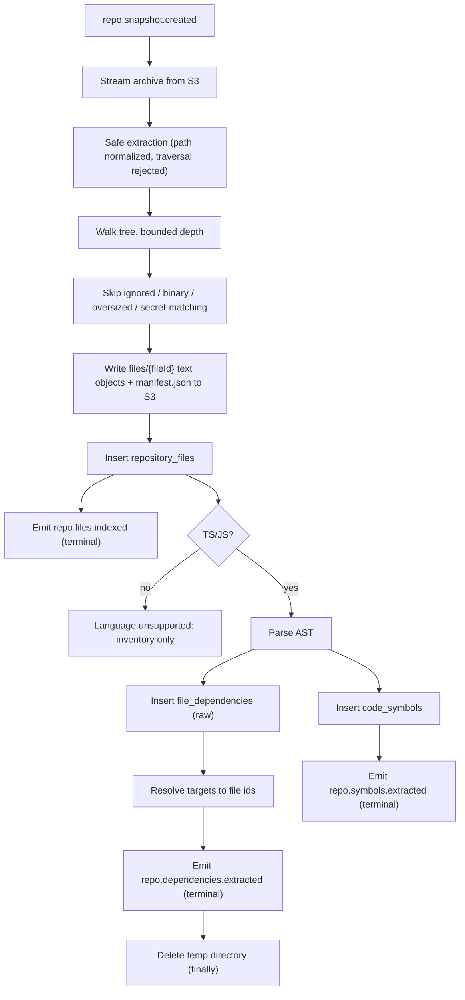

# Indexer Service — Parser Module

> **Deployable:** `indexer` (`@aca/indexer`) · **Port:** 3100 · **Database:** `aca_indexer`
> **Sibling modules:** Repositories & Snapshots, Pipeline, Graph

## Purpose

The Parser module turns a snapshot archive into durable facts: a filtered file inventory, per-file text in object storage, extracted symbols, and **resolved** import edges.

## Flow Chart



## Responsibilities

- Stream and safely extract the snapshot archive.
- Apply ignore rules, size limits, binary detection, and secret-file exclusion.
- Write per-file UTF-8 text objects and a manifest to object storage.
- Build the file inventory.
- Parse TypeScript/JavaScript ASTs for symbols and imports.
- Resolve imports to concrete file IDs, external packages, or `unresolved`.
- Emit terminal stage events with batch metadata.

## File Content Storage — why it exists

The module deletes its temporary directory after processing, and `repository_files` stores no content. Two consumers still need the source text: the `ai` deployable (to chunk and embed) and the citation panel in the web app.

Job payloads cannot carry source code. So this module writes, per snapshot:

```text
s3://{bucket}/{repoId}/{snapshotId}/manifest.json
s3://{bucket}/{repoId}/{snapshotId}/files/{fileId}
```

`manifest.json`:

```json
{
  "repoId": "uuid",
  "snapshotId": "uuid",
  "commitSha": "abc123",
  "generatedAt": "2026-08-19T10:31:00.000Z",
  "files": [
    {
      "fileId": "uuid",
      "path": "src/app.ts",
      "language": "typescript",
      "sizeBytes": 4821,
      "lineCount": 180,
      "contentHash": "sha256:...",
      "objectKey": "{repoId}/{snapshotId}/files/{fileId}"
    }
  ]
}
```

`ai` reads the manifest and streams the objects it needs. `GET /internal/files/:fileId/content` is a single S3 GET. Nothing is duplicated and nothing large travels through the queue.

**Reason:** the original design had no path at all for file text to leave this module, which would have blocked both embedding and citation viewing.

## Safe Extraction

Every archive entry must pass, in order:

1. Reject absolute paths and any entry containing `..` after normalization.
2. Resolve the final path and assert it is inside the extraction root.
3. Reject symlinks and hardlinks entirely — do not attempt to resolve them.
4. Reject entries above `MAX_FILE_SIZE_KB`.
5. Reject if cumulative extracted size exceeds `MAX_EXTRACTED_SIZE_MB` (zip-bomb defence), aborting the whole job.
6. Cap entry count at `MAX_FILES_PER_REPO` and directory depth at `MAX_DIRECTORY_DEPTH`.

Extraction happens in a fresh directory under `TEMP_WORK_DIR`, deleted in a `finally` block on both success and failure.

## Ignore and Exclusion Rules

Ignored directories: `.git`, `node_modules`, `dist`, `build`, `out`, `.next`, `.nuxt`, `.turbo`, `coverage`, `vendor`, `target`, `__pycache__`, `.venv`.

Ignored files: lockfiles, `*.min.js`, `*.map`, snapshots, generated-code markers (`@generated`, `Code generated by`), and anything detected as binary (null byte in the first 8 KB, or a non-text MIME).

**Excluded for security** — never written to S3, never in the inventory, never embedded: `.env*`, `*.pem`, `*.key`, `*.p12`, `*.pfx`, `id_rsa*`, `*.keystore`, `credentials`, `.npmrc`, `.netrc`, and any file matching the secret patterns in `DATA_RETENTION_AND_PRIVACY.md`.

Repository `.gitignore` is **not** honoured — files committed despite it are still real code, and honouring it would make behaviour unpredictable.

## Import Resolution — specified, not improvised

`import { x } from '../utils'` must become an edge to a real file node. Resolution order:

1. Bare specifier matching a workspace package name → that package's entry point.
2. Bare specifier otherwise → `external` (an `external_package` graph node, no file target).
3. `tsconfig.json` `baseUrl` + `paths` aliases, using the nearest tsconfig to the importing file, with `extends` chains followed.
4. Relative path, probing in order: exact, `.ts`, `.tsx`, `.d.ts`, `.js`, `.jsx`, `.mjs`, `.cjs`.
5. Directory → `index.*` with the same extension order.
6. Workspace-internal `package.json` `exports` / `main`.
7. Otherwise → `unresolved`.

`file_dependencies.resolution_status` records which branch applied. Unresolved imports are stored and shown in the UI, never dropped silently.

Import kinds captured: static ESM `import`, `export ... from`, type-only imports (flagged), `require()`, and dynamic `import()` with a literal specifier. Non-literal dynamic imports are recorded as `dynamic_unresolvable`.

**Reason this is a named section:** import resolution is the single hardest correctness problem in the product. Without it, a real repository's dependency graph is missing a large fraction of its edges, and the dependency graph is the flagship feature.

## Unsupported Languages

For non-TS/JS files the module still writes text objects and inventory rows, so chunking, embedding, and chat work. It emits `repo.symbols.extracted` and `repo.dependencies.extracted` with zero items and `languageSupported: false`, so the Pipeline advances and the UI can say precisely which graphs are unavailable.

## APIs

```text
GET /internal/repositories/:repoId/files?cursor=&pageSize=&path=
GET /internal/files/:fileId
GET /internal/files/:fileId/content?startLine=&endLine=
GET /internal/repositories/:repoId/symbols?cursor=&type=&name=
GET /health/live
GET /health/ready
```

## Jobs

**Consumed:** `repo.snapshot.created`
**Published:** `repo.files.indexed`, `repo.symbols.extracted`, `repo.dependencies.extracted`, `repo.stage.failed`

## Database Ownership

```text
services/indexer/migrations/
  020_create_repository_files.sql
  021_create_code_symbols.sql
  022_create_file_dependencies.sql
```

```sql
CREATE TABLE IF NOT EXISTS repository_files (
  id            uuid PRIMARY KEY,
  repo_id       uuid NOT NULL,
  snapshot_id   uuid NOT NULL,
  path          text NOT NULL,
  directory     text NOT NULL,
  extension     text,
  language      text,
  size_bytes    integer NOT NULL,
  line_count    integer NOT NULL DEFAULT 0,
  content_hash  text NOT NULL,
  object_key    text NOT NULL,
  created_at    timestamptz NOT NULL DEFAULT now(),
  UNIQUE (snapshot_id, path)
);

CREATE INDEX IF NOT EXISTS idx_repository_files_repo_snapshot
  ON repository_files (repo_id, snapshot_id);
CREATE INDEX IF NOT EXISTS idx_repository_files_snapshot_dir
  ON repository_files (snapshot_id, directory);

CREATE TABLE IF NOT EXISTS code_symbols (
  id              uuid PRIMARY KEY,
  repo_id         uuid NOT NULL,
  snapshot_id     uuid NOT NULL,
  file_id         uuid NOT NULL REFERENCES repository_files(id) ON DELETE CASCADE,
  parent_symbol_id uuid REFERENCES code_symbols(id) ON DELETE CASCADE,
  symbol_type     text NOT NULL,   -- class | interface | function | method | type | enum | variable
  name            text NOT NULL,
  qualified_name  text,
  signature       text,
  is_exported     boolean NOT NULL DEFAULT false,
  start_line      integer NOT NULL,
  end_line        integer NOT NULL,
  metadata        jsonb NOT NULL DEFAULT '{}'::jsonb,
  created_at      timestamptz NOT NULL DEFAULT now()
);

CREATE INDEX IF NOT EXISTS idx_code_symbols_repo_snapshot_type
  ON code_symbols (repo_id, snapshot_id, symbol_type);
CREATE INDEX IF NOT EXISTS idx_code_symbols_file
  ON code_symbols (file_id);
CREATE INDEX IF NOT EXISTS idx_code_symbols_name
  ON code_symbols (snapshot_id, lower(name));

CREATE TABLE IF NOT EXISTS file_dependencies (
  id                 uuid PRIMARY KEY,
  repo_id            uuid NOT NULL,
  snapshot_id        uuid NOT NULL,
  source_file_id     uuid NOT NULL REFERENCES repository_files(id) ON DELETE CASCADE,
  target_file_id     uuid REFERENCES repository_files(id) ON DELETE CASCADE,
  target_path        text,
  external_package   text,
  raw_specifier      text NOT NULL,
  import_kind        text NOT NULL,   -- esm | require | dynamic | export_from | type_only
  resolution_status  text NOT NULL,   -- resolved | external | unresolved | dynamic_unresolvable
  line               integer,
  created_at         timestamptz NOT NULL DEFAULT now()
);

CREATE INDEX IF NOT EXISTS idx_file_dependencies_source
  ON file_dependencies (source_file_id);
CREATE INDEX IF NOT EXISTS idx_file_dependencies_target
  ON file_dependencies (target_file_id);
CREATE INDEX IF NOT EXISTS idx_file_dependencies_repo_snapshot_status
  ON file_dependencies (repo_id, snapshot_id, resolution_status);
```

The reverse index on `target_file_id` exists because "who imports this file?" is a question users ask constantly, and without it that query is a sequential scan.

## Parsing Approach

- TypeScript compiler API or `ts-morph`, in **worker threads**, so parsing never blocks the event loop.
- Bounded concurrency (`PARSER_CONCURRENCY`), because the compiler API is memory-hungry on large files.
- Per-file timeout; a pathological file is skipped and recorded, not allowed to kill the stage.
- Batch inserts of `PARSER_BATCH_SIZE` rows, emitting a progress event per batch and one terminal event at the end.
- Behind a `LanguageParser` interface so Python, Go, and Java can be added without touching the pipeline.

## Environment Variables

```text
NODE_ENV
PORT=3100
DATABASE_URL
QUEUE_DATABASE_URL
S3_ENDPOINT
S3_ACCESS_KEY_ID
S3_SECRET_ACCESS_KEY
S3_BUCKET_SNAPSHOTS
TEMP_WORK_DIR=/tmp/aca
MAX_FILE_SIZE_KB=512
MAX_FILES_PER_REPO=20000
MAX_EXTRACTED_SIZE_MB=2048
MAX_DIRECTORY_DEPTH=32
PARSER_CONCURRENCY=4
PARSER_FILE_TIMEOUT_MS=10000
PARSER_BATCH_SIZE=500
PROCESSING_TIMEOUT_SECONDS=1800
```

## Security

- Never execute repository code, never evaluate config files, never install dependencies. `tsconfig.json` is read as JSON, not required as a module.
- Reject archive traversal, symlinks, and zip bombs as specified above.
- Exclude secret-bearing files before anything is written anywhere.
- Never log file content, only paths and counts.
- Delete temporary directories in a `finally` block.

## Testing

- Parser unit tests over the checked-in sample repository fixture with asserted symbol and import counts.
- Resolution tests for each branch: relative, extension probing, index directory, tsconfig alias, workspace package, bare external, unresolvable.
- Malicious archive tests: `../` entries, absolute paths, escaping symlinks, zip bomb.
- Skip tests: binary, oversized, ignored, generated, secret-matching.
- Non-TS repository produces inventory and text objects but zero symbols, and still advances the pipeline.
- Duplicate `repo.snapshot.created` is idempotent.
- Temporary directory absent after both success and forced failure.

## Implementation Steps

1. Streaming S3 download and safe extraction with all six guards.
2. File walker, ignore rules, binary detection, secret exclusion.
3. Write per-file text objects and `manifest.json`; insert inventory; emit terminal event.
4. TypeScript parser in worker threads; symbol extraction with line ranges.
5. Raw import extraction.
6. Import resolution algorithm with `resolution_status`.
7. Batch inserts, progress events, terminal events.
8. File and symbol read APIs, including content ranges for citations.
