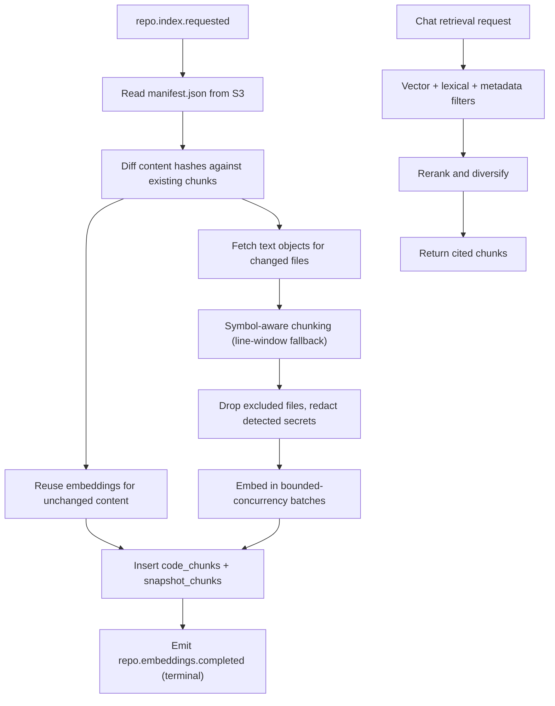

# AI Service — Retrieval Module

> **Deployable:** `ai` (`@aca/ai`) · **Port:** 3200 · **Database:** `aca_ai` (pgvector)
> **Sibling module:** Chat (`CHAT_SERVICE_PLAN.md`)

## Purpose

The Retrieval module owns code chunks, embeddings, and the hybrid search that grounds every chat answer. It reads source text from object storage using the snapshot manifest, chunks it along symbol boundaries, embeds it, and serves cited results.

## Flow Chart



## Responsibilities

- Read the snapshot manifest and per-file text from object storage.
- Chunk source along symbol boundaries where available.
- Generate and store embeddings, reusing them across snapshots by content hash.
- Serve hybrid retrieval with citations.
- Enforce exclusion and redaction rules before anything reaches a provider.
- Record embedding token usage per user.

## Embedding Reuse — the cost decision

Chunks are keyed on **`(repo_id, content_hash)`**, and their membership in a snapshot lives in a link table:

```text
code_chunks        one row per distinct piece of content in a repository
snapshot_chunks    which chunks belong to which snapshot
```

The original design keyed chunks on `(snapshot_id, file_id, content_hash)`. Because `snapshot_id` was part of the key, **every re-import re-embedded the entire repository** even when three files changed. On a 5,000-file repository that is roughly the difference between $0.10 and $8 per re-index, on every push.

With content-hash keying, re-indexing an unchanged repository performs zero embedding calls, and a three-file change embeds only those files.

## Vector Index — HNSW, not IVFFlat

```sql
CREATE INDEX idx_code_chunks_embedding
  ON code_chunks USING hnsw (embedding vector_cosine_ops)
  WITH (m = 16, ef_construction = 64);
```

IVFFlat builds its clusters from the data present at index creation. Created in a migration against an empty table, and with no `lists` parameter, it produces poor recall permanently — search "works" but returns bad chunks, and the LLM gets blamed for it. HNSW needs no training data, is safe to create in a migration, and gives better recall at this scale.

## Embedding Dimensions

The embedding model is **pinned in the migration**, not configurable at runtime. pgvector fixes column dimensionality at DDL time, so an `EMBEDDING_DIMENSIONS` environment variable is a promise the database cannot keep — the original plan had exactly that contradiction.

`code_chunks` stores `embedding_model` and `embedding_version` per row. Changing models is a deliberate data migration: add a new column or table for the new dimensionality, backfill, cut over, drop the old. The procedure is written in `DATA_RETENTION_AND_PRIVACY.md`.

## Chunking Strategy

1. If the file has symbols, chunk on symbol boundaries — one chunk per top-level function, class, or exported member, with a small overlap of preceding context (imports, adjacent comments, class signature for methods).
2. Split symbols exceeding `CHUNK_MAX_TOKENS` at statement boundaries.
3. Merge trivially small adjacent symbols up to the token budget.
4. For files without symbols (unsupported languages, config, Markdown), use a line window of `CHUNK_MAX_TOKENS` with `CHUNK_OVERLAP_TOKENS` overlap.
5. Every chunk records `path`, `startLine`, `endLine`, `language`, `symbolName`, and `symbolType`.

Line ranges are exact, because they become clickable citations.

## Retrieval Strategy

- Vector similarity over the active snapshot's chunks (`top K = RETRIEVAL_TOP_K`, default 40).
- Lexical prefilter when the question names a file, class, or function — a question mentioning `AuthGuard` should not depend on the embedding happening to rank it.
- Metadata filters: path prefix, language, symbol type.
- Rerank to `RETRIEVAL_FINAL_K` (default 16) with per-file diversification, so one large file cannot crowd out the answer.
- Always return `path`, `startLine`, `endLine`, `symbolName`, and a similarity score.
- Return an explicit empty result rather than low-relevance filler, so Chat can honestly say the repository does not contain the answer.

## APIs

```text
POST /internal/repositories/:repoId/retrieve
POST /internal/repositories/:repoId/search
GET  /internal/repositories/:repoId/chunks/:chunkId
GET  /health/live
GET  /health/ready
```

`POST /retrieve` request:

```json
{
  "query": "how does refresh token rotation work",
  "topK": 16,
  "filters": { "pathPrefix": "services/api", "language": "typescript", "symbolType": "function" }
}
```

Response:

```json
{
  "chunks": [
    {
      "chunkId": "uuid",
      "path": "services/api/src/modules/auth/auth.service.ts",
      "startLine": 88,
      "endLine": 141,
      "symbolName": "rotateRefreshToken",
      "symbolType": "method",
      "language": "typescript",
      "score": 0.83,
      "content": "..."
    }
  ],
  "totalCandidates": 40,
  "snapshotId": "uuid"
}
```

## Jobs

**Consumed:** `repo.index.requested`, `repo.deleted`, `user.deleted`
**Published:** `repo.embeddings.completed`, `repo.stage.failed`

## Database Ownership

```text
services/ai/migrations/
  001_enable_pgvector.sql
  002_create_code_chunks.sql
  003_create_snapshot_chunks.sql
  004_create_embedding_runs.sql
  005_create_processed_events.sql
```

```sql
CREATE EXTENSION IF NOT EXISTS vector;

CREATE TABLE IF NOT EXISTS code_chunks (
  id                uuid PRIMARY KEY,
  repo_id           uuid NOT NULL,
  content_hash      text NOT NULL,
  path              text NOT NULL,
  start_line        integer NOT NULL,
  end_line          integer NOT NULL,
  language          text,
  symbol_name       text,
  symbol_type       text,
  token_count       integer NOT NULL DEFAULT 0,
  content           text NOT NULL,
  embedding         vector(1536) NOT NULL,
  embedding_model   text NOT NULL,
  embedding_version integer NOT NULL DEFAULT 1,
  metadata          jsonb NOT NULL DEFAULT '{}'::jsonb,
  created_at        timestamptz NOT NULL DEFAULT now(),
  UNIQUE (repo_id, content_hash)
);

CREATE INDEX IF NOT EXISTS idx_code_chunks_repo
  ON code_chunks (repo_id);
CREATE INDEX IF NOT EXISTS idx_code_chunks_path
  ON code_chunks (repo_id, path);
CREATE INDEX IF NOT EXISTS idx_code_chunks_symbol
  ON code_chunks (repo_id, lower(symbol_name));
CREATE INDEX IF NOT EXISTS idx_code_chunks_embedding
  ON code_chunks USING hnsw (embedding vector_cosine_ops)
  WITH (m = 16, ef_construction = 64);

CREATE TABLE IF NOT EXISTS snapshot_chunks (
  snapshot_id uuid NOT NULL,
  chunk_id    uuid NOT NULL REFERENCES code_chunks(id) ON DELETE CASCADE,
  file_id     uuid NOT NULL,
  PRIMARY KEY (snapshot_id, chunk_id)
);

CREATE INDEX IF NOT EXISTS idx_snapshot_chunks_snapshot
  ON snapshot_chunks (snapshot_id);

CREATE TABLE IF NOT EXISTS embedding_runs (
  id                uuid PRIMARY KEY,
  repo_id           uuid NOT NULL,
  snapshot_id       uuid NOT NULL,
  status            text NOT NULL,
  total_chunks      integer NOT NULL DEFAULT 0,
  embedded_chunks   integer NOT NULL DEFAULT 0,
  reused_chunks     integer NOT NULL DEFAULT 0,
  prompt_tokens     integer NOT NULL DEFAULT 0,
  error_code        text,
  created_at        timestamptz NOT NULL DEFAULT now(),
  updated_at        timestamptz NOT NULL DEFAULT now(),
  UNIQUE (snapshot_id)
);
```

`embedding_runs` is explicitly **internal telemetry**, not a second source of user-visible progress. The Pipeline module in `indexer` remains the only authority on job status; this table exists to answer "how many embeddings did that cost" and to make the reuse rate observable. The original plan had two overlapping progress tables with no stated precedence.

## Environment Variables

```text
NODE_ENV
PORT=3200
DATABASE_URL                       # aca_ai
QUEUE_DATABASE_URL
REDIS_URL
S3_ENDPOINT
S3_ACCESS_KEY_ID
S3_SECRET_ACCESS_KEY
S3_BUCKET_SNAPSHOTS
INTERNAL_JWT_SECRET
INDEXER_SERVICE_URL
LLM_PROVIDER=openai
EMBEDDING_MODEL=text-embedding-3-small
EMBEDDING_BATCH_SIZE=96
EMBEDDING_CONCURRENCY=4
CHUNK_MAX_TOKENS=512
CHUNK_OVERLAP_TOKENS=64
RETRIEVAL_TOP_K=40
RETRIEVAL_FINAL_K=16
RETRIEVAL_MIN_SCORE=0.25
```

`EMBEDDING_DIMENSIONS` is deliberately absent — see above.

## Security

- Never embed excluded files: `.env*`, keys, certificates, credential files, binaries, lockfiles, generated code.
- Run secret detection over chunk content and redact matches before embedding and before returning content to Chat.
- Never log chunk content; log only path, line range, and counts.
- Trust `repoId` only from a valid internal service token; never from the request body.
- Apply backpressure: bounded concurrency, provider-aware retry with jitter, and a circuit breaker on repeated provider failures.

## Testing

- Chunk boundaries for classes, methods, oversized functions, and files without symbols.
- Line ranges exactly match the source, verified against the fixture.
- **Zero embedding calls** when re-indexing an unchanged repository.
- Only changed files embed after a three-file edit.
- Excluded and secret-matching files are provably absent from `code_chunks`.
- Secret redaction applied to content stored and returned.
- Retrieval returns the expected chunk for a known question about the fixture.
- Empty results returned rather than low-relevance filler below `RETRIEVAL_MIN_SCORE`.
- HNSW index used by the query plan, asserted with `EXPLAIN`.
- pgvector migration applies cleanly from empty.

## Implementation Steps

1. pgvector migration with HNSW.
2. Manifest reader and content-hash diff against existing chunks.
3. Symbol-aware chunker with line-window fallback.
4. Exclusion and secret-redaction pass.
5. Embedding adapter with batching, concurrency limits, and backoff.
6. Chunk and link-table writes; `embedding_runs` telemetry.
7. Hybrid retrieval with lexical prefilter, metadata filters, rerank, and diversification.
8. Deletion handlers for `repo.deleted` and `user.deleted`.
